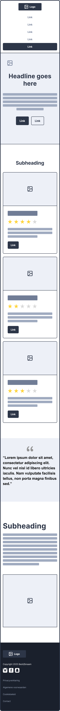

# Eindopdracht

**Inhoudsopgave**

- [Eindopdracht](#eindopdracht)
  - [De eindopdracht](#de-eindopdracht)
  - [Voorbeeld screencast](#voorbeeld-screencast)
  - [Inleveren](#inleveren)
  - [Voorbereiding](#voorbereiding)
  - [Hulpbronnen](#hulpbronnen)
  - [Wireframes nabouwen](#wireframes-nabouwen)
    - [Desktop wireframe - Home](#desktop-wireframe---home)
    - [Desktop wireframe - Contact](#desktop-wireframe---contact)
    - [Mobile wireframe - Home](#mobile-wireframe---home)
    - [Mobile wireframe - Contact](#mobile-wireframe---contact)

  

## De eindopdracht

De informatie over de opdracht, het inleveren en de voorwaarden zijn te vinden in de cursushandleiding.   **_Lees de
cursushandleiding aandachtig door!_**

⚠️ Het is de bedoeling dat je alleen de **_stof uit de voorgaande lessen_** gebruikt om je gekozen wireframe om te
zetten naar HTML en CSS.   ⚠️ Je schrijft alle code zelf.

 

## Voorbeeld screencast

In [de video op Brightspace](https://brightspace.hr.nl/d2l/le/lessons/192811/units/824025) krijg je een uitleg over
wat er in jouw screencast moet zitten en kun je een voorbeeld bekijken.

 

## Inleveren

Maak een screencast en ga naar [Brightspace](https://brightspace.hr.nl/d2l/le/lessons/192811/topics/852693) om jouw
screencast in te leveren.

 

## Voorbereiding

- Verzamel content in de vorm van foto's en tekst. Het mag een fictief product zijn of een bestaand product. Zorg dat
  er voldoende content is om de website body te geven en gebruik geen _placeholder teksten_ of _placeholder
  afbeeldingen_. Je kan eventueel ChatGPT gebruiken om een _fake product_ voor je te bedenken en bijbehorende teksten
  te genereren.
- Stel een huisstijlkleur vast. Dit wordt de basiskleur van je buttons en accent elementen.
- Kies een Google Font. Je mag een apart font voor headers en body tekst gebruiken.

 

## Hulpbronnen

Om jezelf nog verder te helpen volgen hier enkele hulpbronnen:

- Padding & margin
  - [Video: Margin and Padding Deep Dive: The basics](https://www.youtube.com/watch?v=EhbZGV2dqZ4)
- CSS Grid
  - [Documentatie op W3Schools](https://www.w3schools.com/css/css_grid.asp)
  - [Documentatie op Mozilla](https://developer.mozilla.org/en-US/docs/Web/CSS/CSS_grid_layout)
  - [Stap voor stap uitleg van CSS grid](https://www.joshwcomeau.com/css/interactive-guide-to-grid/)
  - [Video waarin alle mogelijkheden worden getoond met demo's](https://youtu.be/EiNiSFIPIQE?si=3hd2dZh_BLXVhWhj)
  - [Spelletje om CSS grid te leren gebruiken](https://cssgridgarden.com/#nl)
- CSS variabelen
  - [Documentatie op W3Schools](https://www.w3schools.com/css/css3_variables.asp)
  - [Documentatie op MDN](https://developer.mozilla.org/en-US/docs/Web/CSS/CSS_cascading_variables/Using_CSS_custom_properties)
- Semantische HTML
  - [Veelgebruikte semantische HTML-tags](https://www.w3schools.com/html/html5_semantic_elements.asp)
  - [Lijst met alle HTML-tags](https://www.w3schools.com/TAGS/default.asp) (alleen `
` en `` zijn niet
    semantisch)

 

## Wireframes nabouwen

De opdracht is om onderstaande wireframes na te bouwen, zoals omschreven in de cursushandleiding. Hieronder staan nog
enkele tips om je hierbij te helpen.

> ### Tips voor het bouwen
>
> - Bouw eerst de basisstructuur op met `semantic` tags;
> - Bouw één voor één de rijen na, in plaats van alles tegelijk op te willen lossen;
> - Gebruik `display:flex` om elementen naast elkaar te zetten;
> - Hou de `flex-documentatie` bij de hand, en gebruik de `flex-inspector` in je browser.
> - Je mag `
` gebruiken om binnen sections containers aan te maken, wanneer je dit puur voor de styling nodig
>   hebt;
> - Gebruik `margin` en `padding` om ruimte te creëren rondom je containers en binnen je containers
> - Je kan het **★** karakter gebruiken voor de "star ratings".
> - 😱 Als iets niet lukt, ga dan niet "_paniek-googlen_". Geef aan waar je op vastloopt bij je docent, medestudent of
>   peercoach. Of gebruik AI-tools om vragen aan te stellen, zodat je daarvan leert, maar neem niet klakkeloos
>   gegenereerde code over.

### Desktop wireframe - Home

[Download: Wireframe home - Desktop](https://github.com/user-attachments/files/21250046/wireframe-home-desktop.pdf)

### Desktop wireframe - Contact

[Download: Wireframe contact - Desktop](https://github.com/user-attachments/files/21250001/wireframe-contact-desktop.pdf)

 

### Mobile wireframe - Home

[Download: Wireframe home - Mobile](https://github.com/user-attachments/files/21250054/wireframe-home-mobile.pdf)

### Mobile wireframe - Contact

[Download: Wireframe contact - Mobile](https://github.com/user-attachments/files/21250034/wireframe-contact-mobile.pdf)
