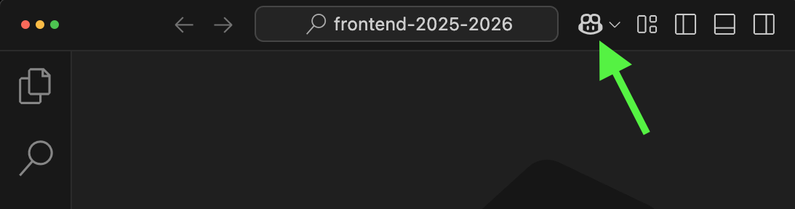
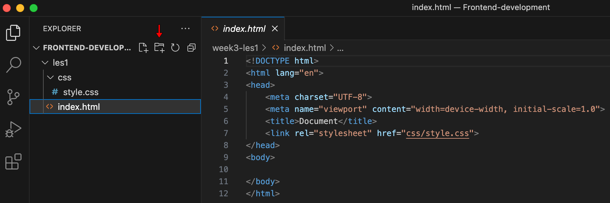
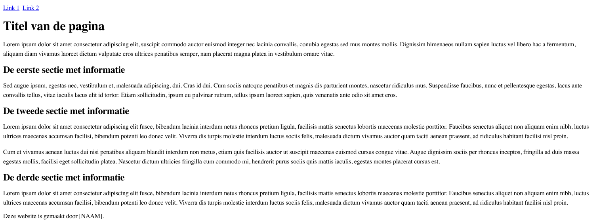
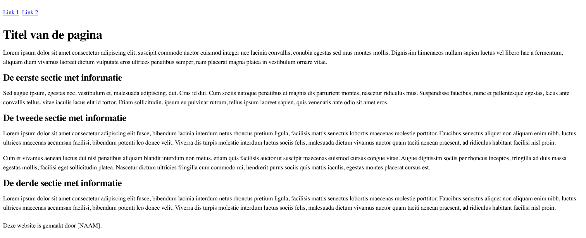
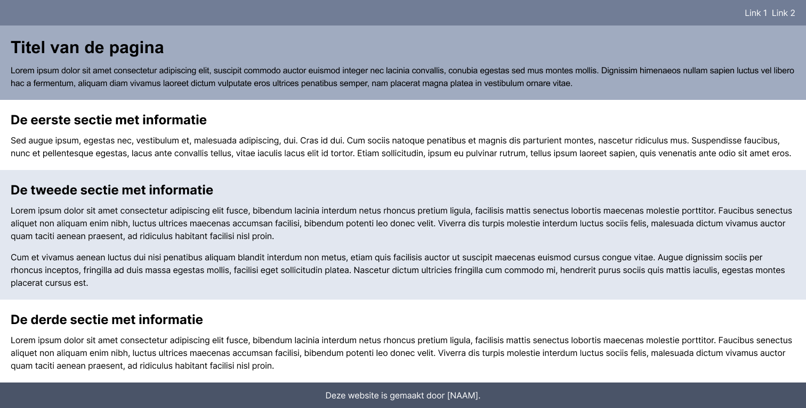

# Les 1

<br>

**Inhoudsopgave**

- [Les 1](#les-1)
  - [Leerdoelen](#leerdoelen)
  - [Opdracht 1 - Werkomgeving gereed maken](#opdracht-1---werkomgeving-gereed-maken)
    - [Opdracht 1a - Visual Studio Code installeren](#opdracht-1a---visual-studio-code-installeren)
    - [Opdracht 1b - Extensie Live Server installeren](#opdracht-1b---extensie-live-server-installeren)
    - [Opdracht 1c - Copilot configureren](#opdracht-1c---copilot-configureren)
    - [opdracht 1e - Eerste project aanmaken](#opdracht-1e---eerste-project-aanmaken)
    - [Opdracht 1e - Bestandsstructuur HTML en CSS](#opdracht-1e---bestandsstructuur-html-en-css)
    - [Opdracht 1f - Code testen](#opdracht-1f---code-testen)
  - [Opdracht 2 - Minipuzzels padding \& margin](#opdracht-2---minipuzzels-padding--margin)
  - [Opdracht 3 - HTML](#opdracht-3---html)
  - [Opdracht 4 - Basisstructuur HTML](#opdracht-4---basisstructuur-html)
  - [Opdracht 5 - CSS](#opdracht-5---css)
  - [Opdracht 6 - Images](#opdracht-6---images)

<br><br><br>

## Leerdoelen

In deze les ligt de focus op het volgende leerdoel:

| Leerdoel                                                                                                            | Toelichting                                            |
| ------------------------------------------------------------------------------------------------------------------- | ------------------------------------------------------ |
| 1. Ik kan de relatie tussen HTML en CSS uitleggen en kan hiermee een semantische en toegankelijke webpagina bouwen. | In deze les leer je de basisbeginselen van HTML & CSS. |

<br>

Alle leerdoelen zijn terug te vinden in de [cursushandleiding](https://brightspace.hr.nl/d2l/home/192811) @TODO: juiste
link invoeren.

<br><br><br>

## Opdracht 1 - Werkomgeving gereed maken

Om te kunnen beginnen met programmeren heb je een app nodig waarin dit kan, ook wel een
[IDE](https://en.wikipedia.org/wiki/Integrated_development_environment) genoemd. In onderstaande stappen installeer je
eerst `Visual Studio Code` en vervolgens de extensie `Live Server` en maak je je eerste project aan.

<br><br>

### Opdracht 1a - Visual Studio Code installeren

1. Ga naar https://code.visualstudio.com en klik op de download-knop;
2. Op een MacBook: open het gedownloade bestand en versleep de app naar de apps-map;
3. Op een Windows: open het gedownloade bestand en doorloop de stappen van de installatie met de standaard
   instellingen.

<br><br>

### Opdracht 1b - Extensie Live Server installeren

Om de door jou geschreven code te testen in de browser heb je een extensie nodig die dit mogelijk maakt, genaamd
`Live Server`. Hiermee worden wijzigingen die je in de code maakt direct zichtbaar in de browser. In deze opdracht ga
je de extensie alleen installeren, dus nog niet gebruiken, dat komt pas bij [opdracht 1f](#opdracht-1f---code-testen).

1. Wanneer Visual Studio Code geopend is, klik je links op `Extensions` (het icoontje met vier blokjes);
2. Voer `Live Server` in de zoekbalk in en installeer de extensie (het is degene gemaakt door Ritwick Dey).

<br>

> De browser is een app op jouw laptap waarmee je websites bekijkt. Bekende browsers zijn Microsoft Edge, Google
> Chrome, Firefox en Safari.

<br><br>

### Opdracht 1c - Copilot configureren

Copilot is AI-chat ingebouwd in Visual Studio Code. Aan deze chat kan je vragen stellen over jouw code en is het zelfs
mogelijk om code te genereren. In deze opdracht ga je Copilot configureren. Je hebt hier maar één ding voor nodig: een
GitHub-account. GitHub is een platform waarop je code kunt plaatsen en delen met anderen. Dit platform ga je gedurende
je hele schoolcarrière (en waarschijnlijk daarna) gebruiken, dus die ga je meteen aanmaken.

1. Klik op de knop van Copilot (zie screenshot hieronder);



2. Klik op de knop om in te loggen en maak een GitHub-account aan als je deze nog niet hebt (kies een passende
   gebruikersnaam, iedereen (waaronder docenten) zullen deze naam zien);

<br>

Copilot is nu geconfigureerd en je kunt het gaan gebruiken. In een latere les leer je er optimaal mee werken.

<br><br>

### opdracht 1e - Eerste project aanmaken

Voor ieder project waaraan je werkt maak je een nieuw project aan in Visual Studio Code. Je gaat nu jouw eerste project
aanmaken. Dit project kan je gedurende het vak gebruiken om de lesopdrachten te maken. Voor de eindopdracht van dit vak
maak je (op een later moment) weer een nieuw project aan.

1. Het aanmaken van een nieuw project is zo simpel als het aanmaken van een nieuwe map. Klik links boven op
   `File -> Open Folder...`;
2. Ga naar de map waar je dit project wilt neerzetten en maak daar een nieuwe map aan met de gewenste naam,
   bijvoorbeeld `frontend-development` (de naam mag geen spaties bevatten). Klik vervolgens op `Open` of
   `Map selecteren`;
3. Je hebt nu je eerste project aangemaakt!
4. Misschien krijg je een melding, klik dan op `Yes, I trust the authors`.

<br><br>

### Opdracht 1e - Bestandsstructuur HTML en CSS

Wanneer je met HTML en CSS werkt heb je altijd een bepaalde `bestandsstructuur` nodig van bestanden en mappen. Dat ga
je in deze opdracht aanmaken. Allereerst is het goed om te weten dat je door de lessen heen een aantal hoofdopdrachten
maakt. Iedere hoofdopdracht maak je in een eigen map in het project dat je bij
[opdracht 1e](#opdracht-1d---eerste-project-aanmaken) hebt aangemaakt, met daarin weer diezelfde bestandsstructuur die
je in deze opdracht gaat maken. Je gaat nu dus eerst een map voor de les van vandaag maken. Zorg ervoor dat links de
`Explorer` geopend is (icoontje met de twee A4'tjes). De benodigde knoppen om deze opdracht uit te voeren vind je aan
de linkerzijde, rechts van de projectnaam.

1. Maak een map aan met de naam `les1` (zonder spaties) door op de tweede knop rechts van de projectnaam te klikken
   (zie rode pijl in onderstaand screenshot);
2. Maak in deze nieuwe map een bestand aan met de naam `index.html` en zet de basis-HTML neer door een `!` te typen en
   op de tab-toets te drukken;
3. Maak een map aan met de naam `css` en maak hierin een bestand aan met de naam `style.css`;
4. Koppel het CSS-bestand aan het HTML-bestand door de volgende regel aan de `<head>` in de `index.html` toe te voegen:

```html
<link rel="stylesheet" href="css/style.css" />
```

5. Zorg ervoor dat de `bestandsstructuur` en de code van de `index.html` er als volgt uitzien:



<br><br>

### Opdracht 1f - Code testen

Het project is gereed en je bent klaar om te beginnen met programmeren! Om de door jou geschreven code te testen heb je
de extensie `Live Server` nodig (geïnstalleerd in [opdracht 1b](#opdracht-1b---extensie-live-server-installeren)). Met
de volgende stappen leer je hoe je deze extensie gebruikt.

1. Plaats eerst content in de `<body>`, bijvoorbeeld: `<h1>Hallo Wereld</h1>`
2. Klik met de rechter muistoets op `index.html` in de linker zijbalk en vervolgens op `Open with Live Server`.
3. Het document wordt nu geopend in de browser en je zou de heading `Hallo wereld` moeten zien.
4. Wanneer je iets wijzigt in je code en het bestand opslaat wordt dit automatisch bijgewerkt in de browser. Pas de h1
   maar eens aan naar: `<h1>Hallo wereld, mijn naam is [JOUW NAAM]</h1>` en sla het bestand op (MacBook: CMD+S /
   Windows: CTRL+S). Wanneer je de browser opent zie je als het goed is dat deze wijziging direct zichtbaar is.

> Je hoeft dus niet telkens opnieuw de `live server` te starten!

<br><br><br>

> ⚠️ Opdracht 3 t/m 5 maak je in de bestanden die je bij [opdracht 1e](#opdracht-1e---bestandsstructuur-html-en-css)
> hebt gemaakt.

<br>

## Opdracht 2 - Minipuzzels padding & margin

[Klik hier om de naar de minipuzzels te gaan.](./minipuzzels)

<br><br><br>

## Opdracht 3 - HTML

Bouw het volgende ontwerp na _(klik op de afbeelding om te vergroten)_. <br> In de tabel hieronder zie je welke
HTML-tags je nodig hebt voor deze opdracht.

> Als bonus mag je de navigatielinkjes bovenin werkend maken, maar dit is niet vereist voor deze opdracht.



<br>

Je hebt hier het volgende voor nodig:

| HTML | CSS | Gebruikte kleuren |
| ---- | --- | ----------------- |
| h1   | -   | -                 |
| h2   |     |                   |
| p    |     |                   |
| a    |     |                   |

<br>

> ### Dummy text
>
> Bij het maken van je website kan het nodig zijn om alvast **dummy tekst** te plaatsen, om te zien of je layout goed
> werkt. Genereer hiervoor passende teksten met <a href="https://chat.openai.com" target="_blank">ChatGPT</a> of met de
> Copilot-chat in Visual Studio Code.

<br>

**Hulpbronnen opdracht 3**

- [Introductievideo HTML & CSS](https://www.youtube.com/watch?v=VrOva3hrlSA)
- [Introductievideo HTML](https://www.youtube.com/watch?v=WO2jDnff6pk) (_bekijk tot 04:33, het deel erna is niet van
  toepassing voor dit vak_)

<br><br><br>

## Opdracht 4 - Basisstructuur HTML

Nu je de tekstuele elementen in de vorige opdracht hebt aangemaakt, wordt het tijd om hier structuur in aan te brengen
met semantische tags. Zoals je in onderstaand ontwerp ziet, zal na deze opdracht de pagina visueel nog niet veranderd
zijn, maar op de achtergrond heb je essentiële stappen genomen. In de tabel hieronder zie je welke HTML-tags je nodig
hebt voor deze opdracht.



<br>
Je hebt hier het volgende voor nodig:

| HTML    | CSS | Gebruikte kleuren |
| ------- | --- | ----------------- |
| header  | -   | -                 |
| main    |     |                   |
| footer  |     |                   |
| nav     |     |                   |
| section |     |                   |

<br>

**Hulpbronnen opdracht 4**

- [Instructie CMGT-dag over structuur aanbrengen](https://www.youtube.com/watch?v=h042V7L6NXM&t=160s) (_de video start
  op 02:40, bekijk tot 08:00, de rest is niet van toepassing voor deze opdracht_)
- [Cheatsheet HTML & CSS](./cheatsheet/Cheatsheet-HTML-CSS.pdf)
- [Wireframe basisstructuur HTML](./images/Basisstructuur-HTML.jpg)

<br><br><br>

## Opdracht 5 - CSS

Bouw het volgende ontwerp na _(klik op de afbeelding om te vergroten)_. <br> De HTML van de pagina staat nu volledig,
dus het wordt tijd om hier styling aan te geven met CSS. In de tabel hieronder zie je wat je nodig hebt in de CSS voor
deze opdracht.



<br>

Je hebt hier het volgende voor nodig:

| HTML | CSS                    | Gebruikte kleuren |
| ---- | ---------------------- | ----------------- |
| -    | Selecting o.b.v. tag   | #717D96           |
|      | Selecting o.b.v. class | #A0ABC0           |
|      | font-family            | #E2E7F0           |
|      | color                  | #4A5468           |
|      | background-color       | #FFFFFF           |
|      | text-align             |                   |
|      | padding                |                   |

<br>

**Hulpbronnen opdracht 5**

- [Cheatsheet HTML & CSS](./cheatsheet/Cheatsheet-HTML-CSS.pdf)
- [Introductievideo CSS](https://www.youtube.com/watch?v=7KrEybPFC48) (_bekijk tot 11:00, het deel erna is niet van
  toepassing voor dit vak_)
- [Video: Margin and Padding Deep Dive: The basics](https://www.youtube.com/watch?v=EhbZGV2dqZ4)

<br><br><br>

## Opdracht 6 - Images

Voeg één of meerdere afbeeldingen toe aan jouw pagina. Je mag zelf bepalen welke afbeeldingen je voor deze oefening
gebruikt en waar je ze op de pagina toevoegt. Dit werkt iets anders dan je gewend bent in Codepen. Je zult de
afbeelding namelijk eerst moeten opslaan in de projectmap, om die vervolgens in te laden in de HTML. Doorloop de
volgende stappen:

1. Maak in de map `les1` een nieuwe map aan en noem deze `images`;
2. Plaats in deze nieuwe map jouw afbeelding(en);
3. Voer tot slot de afbeelding(en) in de HTML in met de volgende code (vervang de placeholders):

```html

```

Zoals je kunt zien gebruik je hier als `src` niet de gehele url, maar je voert het `pad naar de afbeelding` in vanaf de
`index.html` gezien. Dit noem je een `relatief pad`. Dus stel, de bestandsnaam van jouw afbeelding is
`profielfoto.jpg`, dan is het relatieve pad dat je moet invoeren `images/profielfoto.jpg`.
