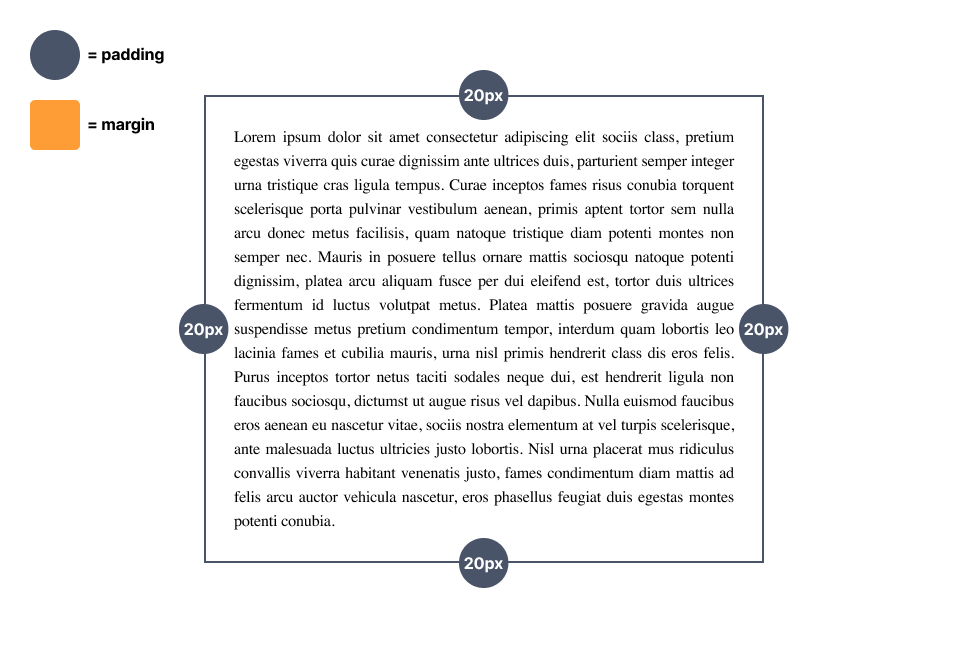
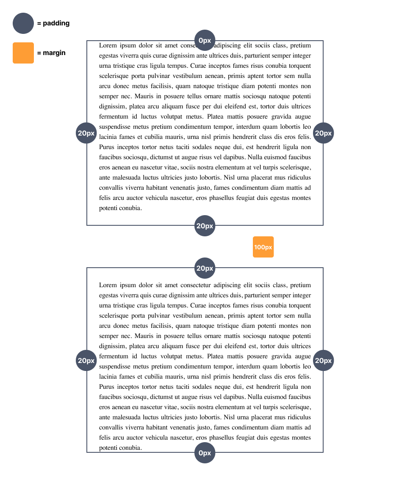
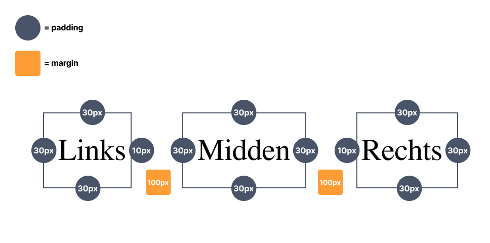
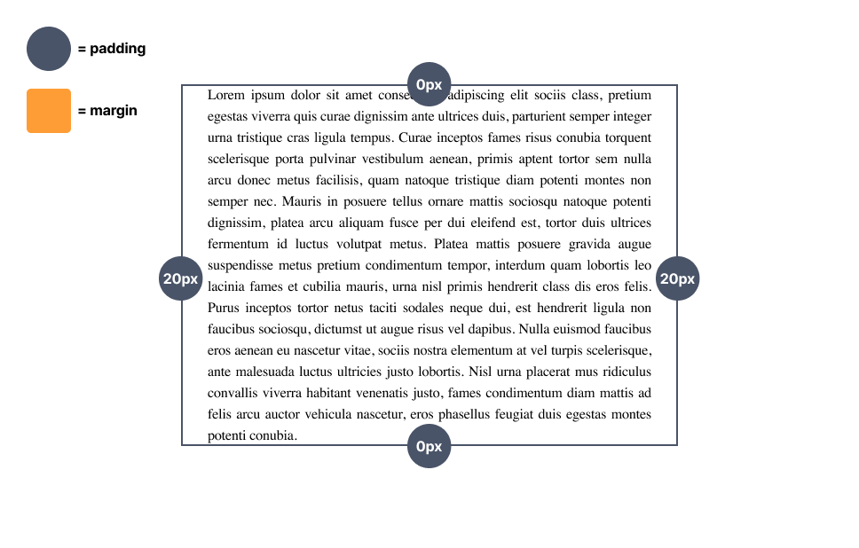
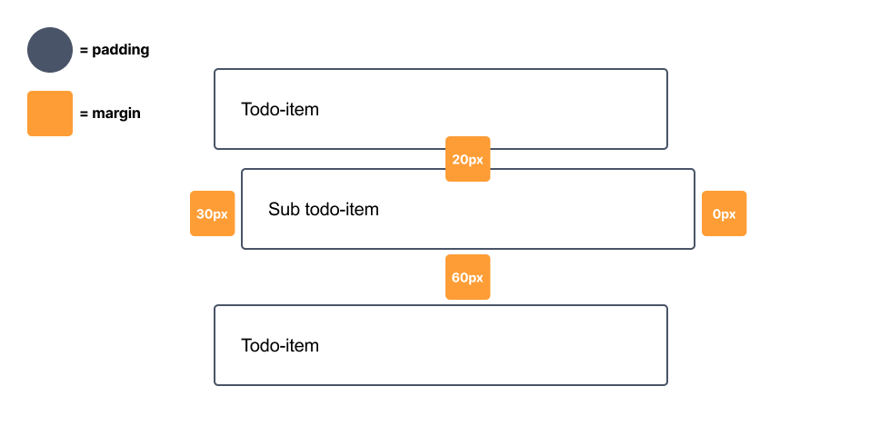
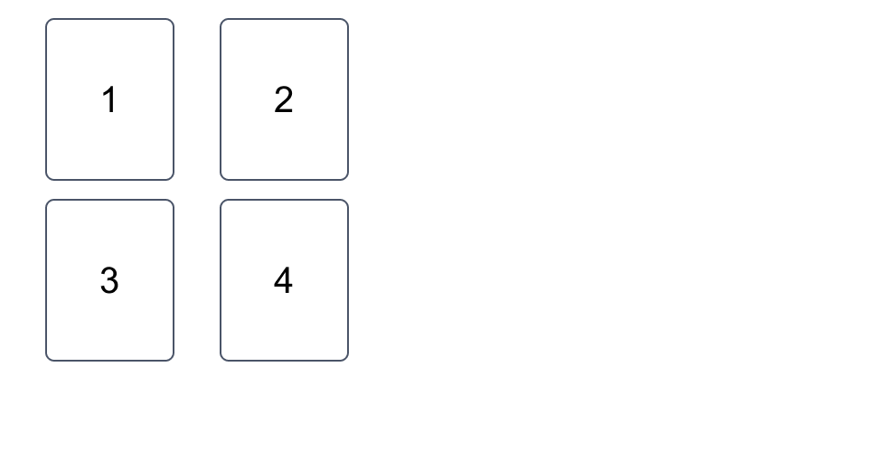

# Les 1 - Minipuzzels - Padding & margin

 

**Inhoudsopgave**

- [Les 1 - Minipuzzels - Padding \& margin](#les-1---minipuzzels---padding--margin)
  - [Inleiding](#inleiding)
  - [Startcode downloaden](#startcode-downloaden)
    - [Hulpbronnen](#hulpbronnen)
  - [Minipuzzel 1](#minipuzzel-1)
  - [Minipuzzel 2](#minipuzzel-2)
  - [Minipuzzel 3](#minipuzzel-3)
  - [Minipuzzel 4](#minipuzzel-4)
  - [Minipuzzel 5](#minipuzzel-5)
  - [Minipuzzel 6](#minipuzzel-6)

   

## Inleiding

Voltooi onderstaande minipuzzels. Voor iedere oefening is er al code klaargezet die jij moet afronden. Let erop dat
deze oefeningen alleen over CSS gaan. Dus je mag het HTML-bestand wel bekijken, maar schrijf alleen maar code in het
CSS-bestand.

 

## Startcode downloaden

@TODO: update op Brightspace alle linkjes naar de startcode

[Download de startcode uit Brightspace.](https://brightspace.hr.nl/d2l/le/lessons/192811/lessons/847308)

 

### Hulpbronnen

- [Documentatie padding](https://www.w3schools.com/css/css_padding.asp)
- [Documentatie margin](https://www.w3schools.com/css/css_margin.asp)

   

## Minipuzzel 1

Maak de code af door in de CSS `padding` toe te passen, zoals hieronder staat aangegeven _(klik op de afbeelding om te
vergroten)_.

   

## Minipuzzel 2

Maak de code af door in de CSS `padding` en `margin` toe te passen, zoals hieronder staat aangegeven _(klik op de
afbeelding om te vergroten)_. Ook heb je `selectors` nodig voor deze opdracht.

   

## Minipuzzel 3

Maak de code af door in de CSS `padding` en `margin` toe te passen, zoals hieronder staat aangegeven _(klik op de
afbeelding om te vergroten)_. Ook heb je `selectors` nodig voor deze opdracht.

   

## Minipuzzel 4

Maak de code af door in de CSS `padding` toe te passen, zoals hieronder staat aangegeven _(klik op de afbeelding om te
vergroten)_.

> **LET OP:** Je moet het met 1 regel code oplossen in het CSS-bestand.

   

## Minipuzzel 5

Maak de code af door in de CSS `margin` toe te passen, zoals hieronder staat aangegeven _(klik op de afbeelding om te
vergroten)_.

> **LET OP:** Je moet het met 1 regel code oplossen in het CSS-bestand.

   

## Minipuzzel 6

Maak de code af door in de CSS `padding` en `margin` toe te passen, maar deze keer worden de waardes niet weergegeven
in het ontwerp, die moet je _op het blote oog_ proberen na te bootsen _(klik op de afbeelding om te vergroten)_.

 

[Terug naar hoofdpagina](..)
