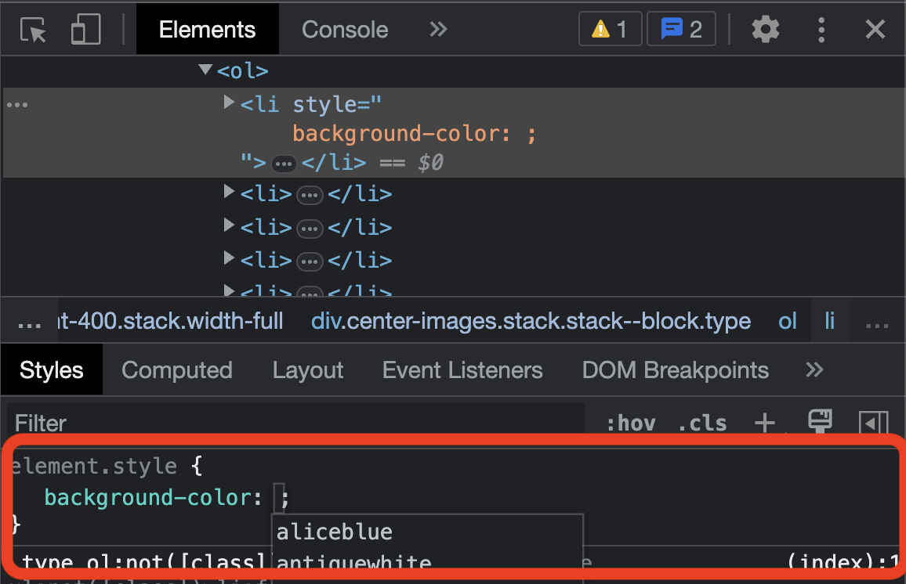
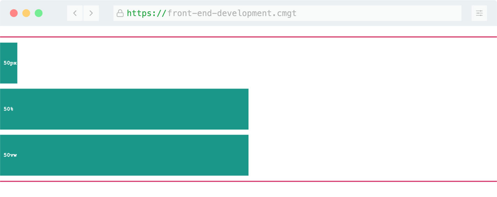
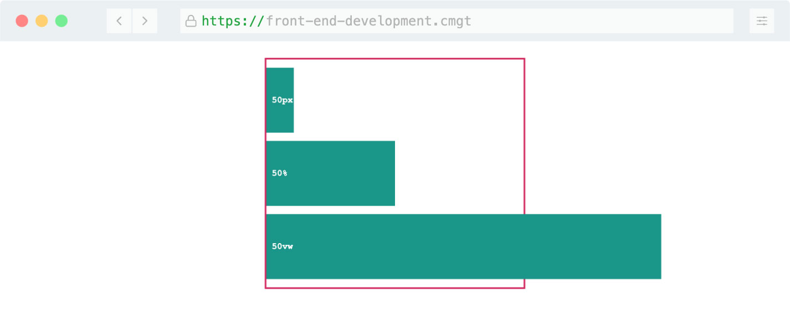
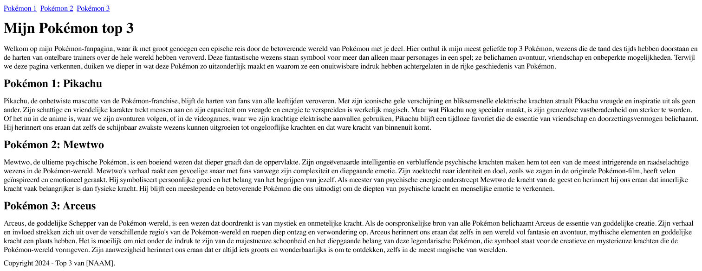
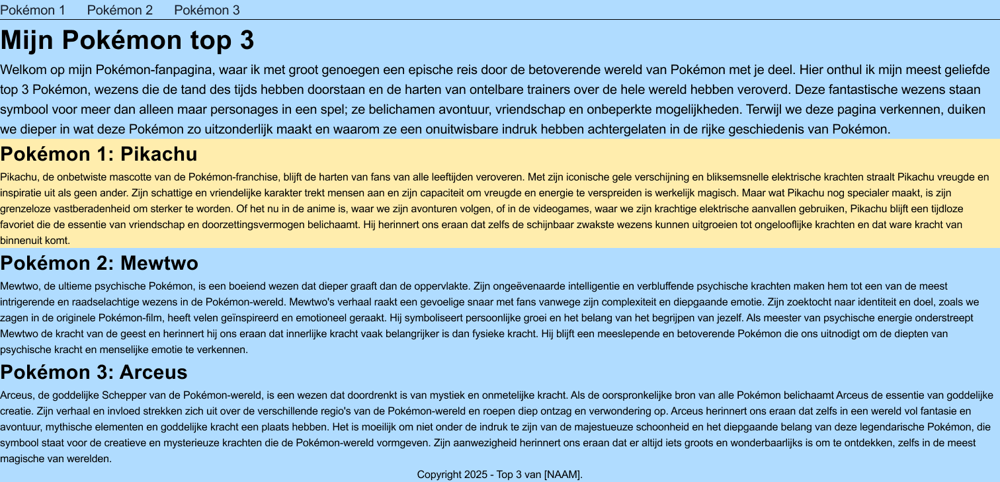
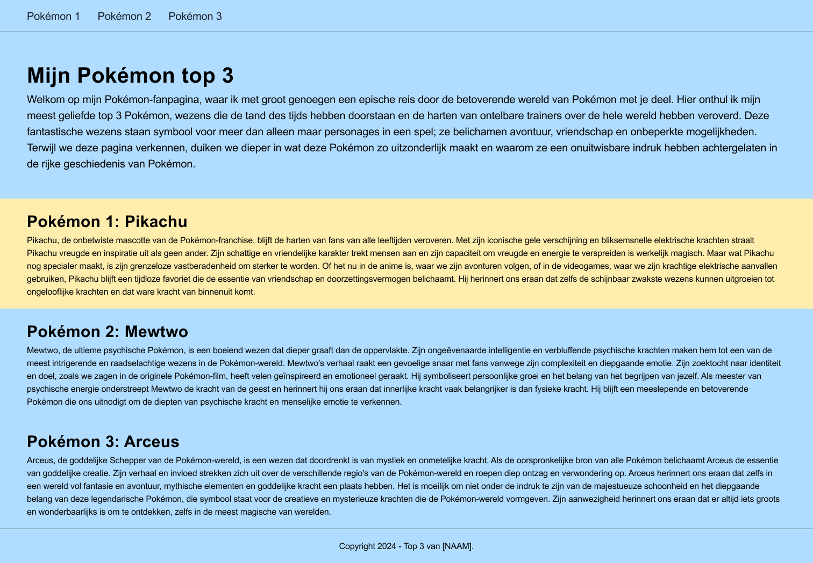
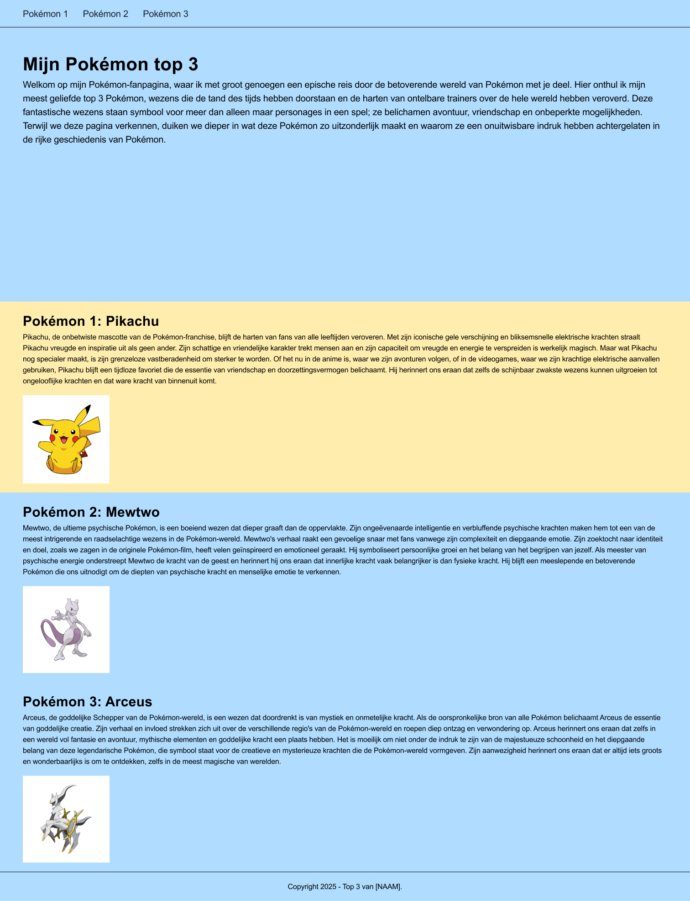
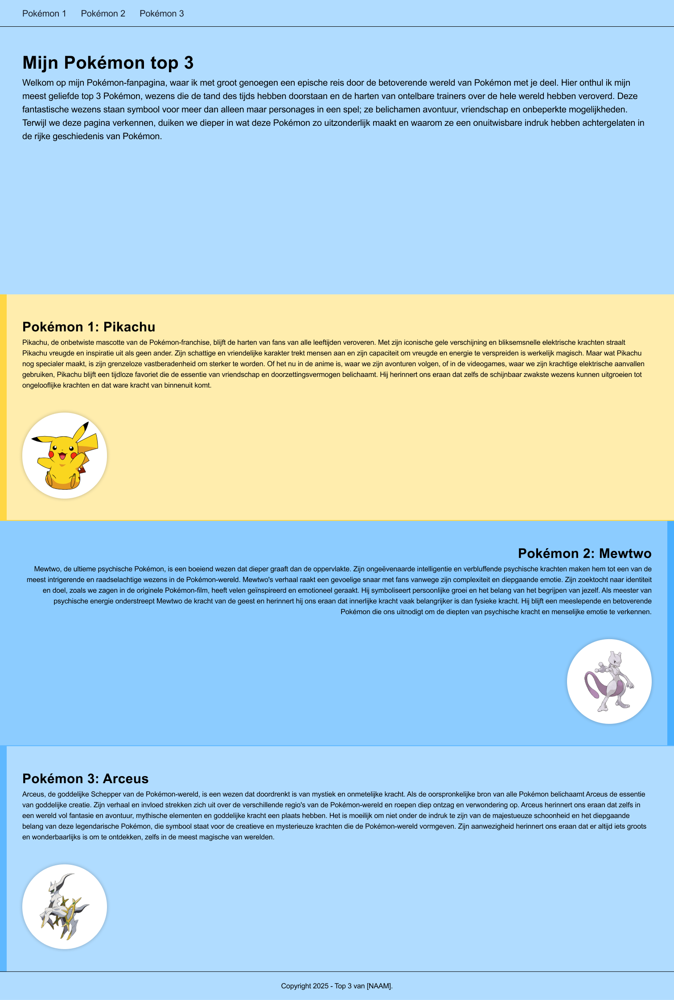
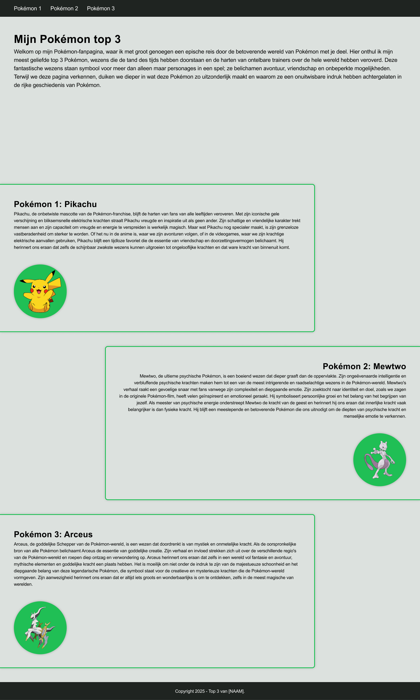

# Les 2

<br>

**Inhoudsopgave**

- [Les 2](#les-2)
  - [Leerdoelen](#leerdoelen)
- [Semantische tags](#semantische-tags)
  - [Waarom semantische tags?](#waarom-semantische-tags)
  - [Semantische tags voor structuur](#semantische-tags-voor-structuur)
  - [Valkuil van semantische tags](#valkuil-van-semantische-tags)
- [Quiz over semantische HTML-tags](#quiz-over-semantische-html-tags)
- [Werken met de inspector](#werken-met-de-inspector)
  - [Opdrachten inspector](#opdrachten-inspector)
- [CSS selectors](#css-selectors)
- [Absolute units en relatieve units](#absolute-units-en-relatieve-units)
  - [Absolute units](#absolute-units)
  - [Relatieve units](#relatieve-units)
  - [Meestgebruikte units](#meestgebruikte-units)
  - [Voorbeelden](#voorbeelden)
  - [Extra hulpbronnen over CSS units](#extra-hulpbronnen-over-css-units)
- [Opdracht: Top 3](#opdracht-top-3)
  - [Opdracht 1 - Semantische HTML](#opdracht-1---semantische-html)
  - [Opdracht 2 - CSS: teksten en kleuren](#opdracht-2---css-teksten-en-kleuren)
  - [Opdracht 3 - CSS: padding \& margin](#opdracht-3---css-padding--margin)
  - [Opdracht 4 - CSS: absolute \& relatieve units](#opdracht-4---css-absolute--relatieve-units)
  - [Opdracht 5a](#opdracht-5a)
  - [Opdracht 5b - Advanced](#opdracht-5b---advanced)

<br><br><br>

## Leerdoelen

In deze les ligt de focus op de volgende leerdoelen:

| Leerdoel                                                                                                                | Toelichting                                                                                                                                                            |
| ----------------------------------------------------------------------------------------------------------------------- | ---------------------------------------------------------------------------------------------------------------------------------------------------------------------- |
| 1. Ik kan de relatie tussen HTML en CSS uitleggen en kan hiermee een semantische en toegankelijke webpagina bouwen.     | In deze les leer je wat semantiek is in HTML en hoe je dit moet toepassen. Ook leer je welke selectors er in CSS beschikbaar zijn om HTML-elementen mee te selecteren. |
| 2. Ik kan uitleggen hoe een layout tot stand komt in de browser en kan een responsive webpagina bouwen met HTML en CSS. | In deze les leer je over absolute en relatieve units.                                                                                                                  |

<br>

Alle leerdoelen zijn terug te vinden in de [cursushandleiding](https://brightspace.hr.nl/d2l/home/192811) @TODO: juiste
link invoeren.

<br><br><br>

# Semantische tags

Er zijn in totaal meer dan 100 HTML-tags en slechts twee ervan zijn **niet** semantisch: `<div>` en `<span>`. Ze zeggen
namelijk niets over de soort inhoud die erin staat. Je mag ze dan ook alleen gebruiken wanneer je het puur nodig hebt
voor de styling van je pagina en er geen semantisch alternatief is.

<br>

## Waarom semantische tags?

Er zijn drie belangrijke redenen waarom je gebruik moet maken van semantische tags:

1. Toegankelijkheid: screenreaders kunnen zo de webpagina beter interpreteren, waardoor slechtzienden een betere
   ervaring hebben op jouw webpagina;
2. SEO: dit staat voor Search Engine Optimization, oftewel zo goed mogelijk gevonden worden door zoekmachines, zoals
   Google;
3. Leesbaarheid voor developers.

<br>

## Semantische tags voor structuur

Hieronder volgt een lijstje met semantische tags die je gebruikt om structuur aan de pagina te geven. Dit zijn niet
alle tags, maar wel de veel voorkomende.

| Tag         | Omschrijving                                                                                                                                                                                                                                                                                                                                                                                                                                                                                                                                                                   |
| ----------- | ------------------------------------------------------------------------------------------------------------------------------------------------------------------------------------------------------------------------------------------------------------------------------------------------------------------------------------------------------------------------------------------------------------------------------------------------------------------------------------------------------------------------------------------------------------------------------ |
| `<header>`  | Definieert inhoud die moet worden beschouwd als de inleidende informatie van een pagina of sectie                                                                                                                                                                                                                                                                                                                                                                                                                                                                              |
| `<nav>`     | Wordt gebruikt voor navigatielinks, oftewel het menu. Het kan worden geplaatst binnen de `<header>`, maar mag ook daarbuiten worden geplaatst. Nagenoeg iedere webpagina heeft een hoofdmenu, maar soms heb je ook een secundair menu, bijvoorbeeld in de `<footer>`                                                                                                                                                                                                                                                                                                           |
| `<main>`    | Bevat de hoofdinhoud van een pagina. Hiervan mag er slechts één tag per pagina zijn.                                                                                                                                                                                                                                                                                                                                                                                                                                                                                           |
| `<footer>`  | Je gebruikt `<footer>` altijd onderaan een pagina. Het is de afsluiter van de pagina en bevat meestal contactgegevens, copyrightinformatie en wat sitenavigatie.                                                                                                                                                                                                                                                                                                                                                                                                               |
| `<section>` | Je gebruikt `<section>` om een webpagina op te splitsen in afzonderlijke secties gerelateerd aan het element waarin ze staan. Dus stel, je hebt een webpagina die gaat over jouw ervaring met een game, dan zou een sectie kunnen gaan over de graphics en een andere over de gameplay; twee verschillende onderwerpen, maar gerelateerd aan hetzelfde onderwerp: de game. Een sectie zou je zelf ook weer kunnen opsplitsen. De sectie over gameplay zou bijvoorbeeld verdeeld kunnen worden in een sectie wat er goed is aan de gameplay, en een sectie wat er niet goed is. |
| `<article>` | Een `<article>` gebruik je om een stukje content te groeperen dat zelfstandig leesbaar is. Voorbeelden hiervan zijn: een forumbericht, een tijdschrift- of krantenartikel, of een blogbericht, een productkaart, een door een gebruiker ingediende opmerking, een interactieve widget of gadget, of enig ander onafhankelijk inhoudsitem.                                                                                                                                                                                                                                      |
| `<aside>`   | Wordt gebruikt om content weer te geven die indirect gerelateerd is aan de hoofdinhoud van de `<section>` of `<article>`waarin die geplaatst is. Ook kan die daarbuiten worden geplaatst, bijvoorbeeld direct in de `<body>`, dan moet de content gerelateerd zijn aan de website zelf, bijvoorbeeld tweets van de auteur, aanvullende navigatie, laatste blogberichten, laatste opmerkingen, etc. Let op: de `<aside>` is iets anders dan een sidebar. <a href="https://aastudio.fr/Sidebar-and-Aside-are-different.html" target="_blank">Lees meer</a>                       |

> ⚠️ Let op: de tag `<div>` is dus **_niet_** semantisch. Je mag hem wel gebruiken binnen semantische tags als
> `<section>`, maar niet ter vervanging ervan.

<br>

## Valkuil van semantische tags

De grote valkuil van het gebruiken van semantische tags, is dat je ze gebruikt voor het uiterlijk dat ze standaard
hebben. Zo is een `<h1>` bijvoorbeeld standaard groter dan een `<h6>`, dus de valkuil is om de heading te gebruiken die
het meest past bij het uiterlijk dat jij zoekt, maar dat is dus niet de bedoeling. Dus onthoudt:

> ⚠️ Je mag een tag _nooit_ gebruiken vanwege het standaard uiterlijk. **_Nooit!_**

Wanneer mag je een tag dan wel gebruiken? Wanneer het de type content representeert die het moet zijn. Is het de
hoofdtitel? Dan gebruik je `<h1>`. Is het de titel daaronder? Dan gebruik je `<h2>`, etc. <br><br> De volgende twee
tags worden ook vaak "misbruikt" vanwege het standaard uiterlijk die ze krijgen, maar gebruik ze dus alleen voor de
inhoudelijke waarde die het heeft.

| Tag        | Omschrijving                                                                                                                                                                                                                              | Voorbeeld in HTML                                                                                                                       | Eindresultaat                                                                                                 |
| ---------- | ----------------------------------------------------------------------------------------------------------------------------------------------------------------------------------------------------------------------------------------- | --------------------------------------------------------------------------------------------------------------------------------------- | ------------------------------------------------------------------------------------------------------------- |
| `<strong>` | Nadruk leggen op een gedeelte van de tekst, omdat deze belangrijk of urgent is.                                                                                                                                                           | `<p>`Voordat hij naar binnen ging, las hij de waarschuwing bij de ingang: `<strong>`Let op! Vuurspuwende draak verderop.`</strong></p>` | Voordat hij naar binnen ging, las hij de waarschuwing bij de ingang: **Let op! Vuurspuwende draak verderop.** |
| `<em>`     | Wanneer je op een gedeelte van de tekst verbaal de nadruk wilt leggen, vaak één woord. Deze is ook gebruikt in de waarschuwing die boven deze tabel is gegeven over dat je een tag _nooit_ mag gebruiken vanwege het standaard uiterlijk. | `<p>`Dit zal `<em>` heel`</em>` erg gevaarlijk worden.`</p>`                                                                            | Dit zal _heel_ erg gevaarlijk worden.                                                                         |

<br>

<br><br><br>

# Quiz over semantische HTML-tags

<a href="https://brightspace.hr.nl/d2l/le/lessons/110777/topics/443925" target="_blank">Klik hier om de quiz over
semantische HTML-tags te doen</a>

<br><br><br>

# Werken met de inspector

Hieronder volgt eerst een uitleg in het gebruik van de inspector. Doorloop dit en voer vervolgens de opdrachten uit.

- Open de inspector op een specifiek HTML-element door met de rechter muistoets op dat element te klikken en vervolgens
  op **Inspecteren** te klikken;
  - Ook is de inspector te openen met de sneltoets ⌥⌘i op Mac en F12 op Windows;
- Van het geselecteerde element zie je ook alle bijbehorende CSS staan. Deze CSS is in de inspector aan te passen en
  dit is dan direct zichtbaar in de browser. Zo kan je spelen met de waardes en real-time wijzingen zien om het ontwerp
  te bepalen. Dit noemen we `Designing in the browser`;
  - **Let op:** wanneer je CSS in de inspector wijzigt, verandert het **_niet_** in de bestanden in Visual Studio Code.
    Dit moet je handmatig wijzigen;



<br>

## Opdrachten inspector

Nu je hebt geleerd hoe je de inspector opent en gebruikt wordt het tijd om deze te gaan gebruiken! Ga naar een website
die jij vaak bezoekt. Deze kan over jouw hobby gaan, maar het kan ook die van een supermarkt zijn, dat maakt niet uit.
Open de inspector en voer de volgende opdrachten daarin uit:

1. Pas van minimaal 3 teksten de kleur aan;
2. Pas van minimaal 3 teksten het lettertype aan;
3. Pas van minimaal 3 elementen de achtergrondkleur aan;
4. Pas de achtergrondkleur van de gehele webpagina aan;

<br><br><br>

# CSS selectors

Met CSS kun je de HTML vormgeven, zoals je vorige les ook al hebt gedaan. Om dit te kunnen doen moet je echter wel
eerst aangeven op welke HTML-elementen die vormgeving van toepassing is. Je moet de elementen zogezegd `selecteren`.

Er zijn veel verschillende manieren om HTML-elementen te selecteren en hieronder vind je de meestgebruikte
`CSS selectors`.

| Naam                  | Omschrijving                                                                                                                                          | Voorbeeld 1            | Voorbeeld 2                 |
| --------------------- | ----------------------------------------------------------------------------------------------------------------------------------------------------- | ---------------------- | --------------------------- |
| Element selector      | Selecteer op HTML-tag                                                                                                                                 | h1                     | p                           |
| Class selector        | Selecteer op class                                                                                                                                    | .button                | .left-column                |
| ID selector           | Selecteer op ID                                                                                                                                       | #my-hobbies            | #about-me                   |
| Descendant selector   | Selecteer alles binnen een parent (in voorbeeld 1 iedere `p` in iedere `section`)                                                                     | section p              | main .button                |
| Compound selector     | Selecteer elementen die aan meerdere voorwaarden voldoet (in voorbeeld 1 iedere `p` die óók de class `highlight` heeft.                               | p.highlight            | .button.success             |
| Pseudo-class selector | Selecteer op pseudo-class die automatisch door de browser wordt gegeven, bijvoorbeeld wanneer je met je muis ergens overheen gaat.                    | .button:hover          |                             |
| Selector list         | Wanneer meerdere selectors dezelfde vormgeving moeten hebben, dan kan je deze scheiden met een komma.                                                 | h1, h2, h3, h4, h5, h6 | .column-left, .column-right |
| Universal selector    | Selecteert alle elementen. Is ook te gebruiken in een `descendant selector` (in voorbeeld 2 worden `alle children` in iedere `section` geselecteerd). | \*                     | section \*                  |

<br>

**Extra hulpbronnen**

- <a href="https://www.w3schools.com/css/css_selectors.asp" target="_blank">Documentatie over selectors op
  W3Schools</a>
- <a href="https://developer.mozilla.org/en-US/docs/Web/CSS/CSS_selectors/Selectors_and_combinators" target="_blank">Documentatie
  over selectors op MDN</a>

<br><br><br>

# Absolute units en relatieve units

CSS units bepalen de afmetingen en posities van elementen op een webpagina. Denk hierbij aan het instellen van de
`width` en `height`, maar bijvoorbeeld ook aan `font-size`, `padding` en `margin`.

In dit hoofdstuk zul je leren over de verschillende soorten units en wanneer je welke moet gebruiken.

## Absolute units

Absolute units hebben een vaste grootte, ongeacht de context waarin ze worden gebruikt. Dit betekent dat de waarde die
je instelt altijd dezelfde blijft, ongeacht de schermgrootte of andere factoren. De meestgebruikte absolute unit is
`px`. Gebruik `px` voor kleine, specifieke afmetingen die consistent moeten zijn, zoals icon-grootte of fijne details.

De voor- en nadelen hiervan zijn:

- **Voordeel**: Je hebt zekerheid over de afmeting van een element, omdat deze nooit veranderd.
- **Nadeel**: Het voordeel is echter ook meteen het nadeel: ze schalen niet op verschillende apparaten en
  schermformaten. Dit kan resulteren in slechte weergave op kleinere of grotere schermen.

Je kan dus op de pixel nauwkeurig een element instellen, maar de kans is groot dat deze instellingen op een groter of
kleiner apparaat niet meer kloppen. Bedenk dus altijd goed:

> Gebruik altijd relatieve units, behalve wanneer het niet anders kan.

<br>

## Relatieve units

Relatieve units geven een grootte aan die afhankelijk is van een andere grootte, zoals de grootte van het
parent-element of van het scherm van de browser (dit noemen we de `viewport`). Ze maken het mogelijk om flexibele en
responsieve ontwerpen te creëren. De voor- en nadelen hiervan zijn:

- **Voordeel**: Flexibel en responsief, geschikt voor verschillende schermformaten. Ze passen zich aan de context aan.
- **Nadeel**: Het is minder geschikt voor gedetailleerde afmetingen, zoals die van icons.

## Meestgebruikte units

Hieronder vind je de tabel met de meestgebruikte units.

| Naam unit | Type     | Omschrijving                                                                                                                                                      | Voorbeeld            |
| --------- | -------- | ----------------------------------------------------------------------------------------------------------------------------------------------------------------- | -------------------- |
| `px`      | Absoluut | Hiermee bepaal je exact hoeveel pixels op je scherm er gebruikt moeten worden.<br> ⚠️ _Gebruik alleen `px` wanneer geen van onderstaande volstaat._               | `width: 200px;`      |
| `%`       | Relatief | Hiermee wordt de waarde bepaald op basis van de breedte of hoogte van de `parent`.                                                                                | `width: 100%;`       |
| `vw`      | Relatief | Hiermee wordt de waarde bepaald op basis van de `breedte` van de viewport (het zichtbare deel van de browser).                                                    | `width: 50vw;`       |
| `vh`      | Relatief | Hiermee wordt de waarde bepaald op basis van de `hoogte` van de viewport (het zichtbare deel van de browser).                                                     | `height: 100vh;`     |
| `rem`     | Relatief | Hiermee wordt de waarde bepaald op basis van de `root font-size`, oftewel de font-size die op de `<html>` staat ingesteld. Gebruik voor `font-size` altijd `rem`. | `font-size: 1.5rem;` |
| `em`      | Relatief | Hiermee wordt de waarde bepaald op basis van de `font-size` van het parent-element.<br> ⚠️ _Gebruik liever `rem` dan `em` omdat die makkelijker te gebruiken is._ | `font-size: 2em;`    |

De vraag die je jezelf iedere keer weer moet stellen is:

> Op basis van **_wat_** moet ik de grootte bepalen?

- Stel, je wilt de `width` van een `section` instellen. Moet deze dan relatief zijn aan de parent (`%`) of aan het hele
  scherm (`vw`)?
- Of je wilt de `height` van de `header` instellen. Moet deze dan relatief zijn aan de hoogte van het scherm (`vh`) of
  moet deze altijd hetzelfde zijn op ieder scherm (`px`)?

Door deze vragen te beantwoorden, kun je de juiste CSS units kiezen en ervoor zorgen dat je ontwerp zowel flexibel als
consistent is op verschillende apparaten en schermformaten. Experimenteer met verschillende units om te begrijpen hoe
ze zich gedragen in verschillende situaties en kies de meest geschikte unit voor elke specifieke toepassing.

## Voorbeelden

Laten we eens kijken naar een voorbeeld van een aantal units: px, % en vw. Hieronder zie je een screenshot van een
webpagina. Hierop staat een `section` met een rode border met daarin drie `div`s. Dit geeft de volgende HTML:

```html
<section>
  <div class="pixels">50px</div>
  <div class="percentage">50%</div>
  <div class="viewport-width">50vw</div>
</section>
```

<br>
In de CSS staat het volgende ingesteld:

- De section heeft een `width` van `100%`;
- De eerste `div` heeft een `width` van `50px` en neemt dus 50 pixels van het scherm in beslag;
- De tweede `div` heeft een `width` van `50%` en is dus de helft van de breedte van zijn parent (dus de `section`);
- De derde `div` heeft een `width` van `50vw` en is dus de helft van de viewport (dus de breedte van de browser).

<br>


<br>

Wat zou er gebeuren wanneer de `section` smaller zou worden? Het enige wat in het screenshot hieronder is aangepast is
de `width` van de `section`, namelijk naar 33%. Het volgende valt op:

- De eerste div blijft nog steeds exact 50 pixels breed;
- De tweede div is smaller geworden, doordat zijn parent (de `section`) smaller is geworden. Hij is echter nog steeds
  precies de helft van zijn parent;
- De derde div is **_niet_** smaller geworden, maar is even breed gebleven. Dit komt doordat de viewport (dus de
  browser) nog steeds dezelfde breedte heeft.

<br>



<br><br>

## Extra hulpbronnen over CSS units

- <a href="https://www.youtube.com/watch?v=N5wpD9Ov_To" target="_blank">Video over welke units te gebruiken</a>

<br><br><br>

# Opdracht: Top 3

## Opdracht 1 - Semantische HTML

Vorige les heb je een project aangemaakt voor dit vak, waarschijnlijk heb je deze `frontend-development` genoemd. Maak
hierin een nieuwe map aan met de naam `top3` (zonder spaties) en zet de basisstructuur neer, zoals uitgelegd in
[opdracht 1d van vorige les](../les1/#opdracht-1d---bestandsstructuur-html-en-css). De komende drie opdrachten maak je
in deze map, dus je breidt jouw webpagina met iedere opdracht uit. <br><br> Bouw vervolgens het volgende ontwerp na
_(klik op de afbeelding om te vergroten)_. <br> Je mag je eigen top 3 bedenken, maar gebruik verder testteksten. De
focus ligt in deze opdracht **_niet_** op de inhoud, maar op de code.



<br>

Je hebt hier het volgende voor nodig:

| HTML    | CSS | Gebruikte kleuren |
| ------- | --- | ----------------- |
| header  | -   | -                 |
| main    |     |                   |
| footer  |     |                   |
| nav     |     |                   |
| section |     |                   |
| h1      |     |                   |
| h2      |     |                   |
| p       |     |                   |
| a       |     |                   |

<br>

**Hulpbronnen opdracht 1**

- <a href="https://www.youtube.com/watch?v=h042V7L6NXM&t=160s" target="_blank">Instructie CMGT-dag over structuur
  aanbrengen</a> (_de video start op 02:40, bekijk tot 08:00, de rest is niet van toepassing voor deze opdracht_)
- <a href="../les1/cheatsheet/Cheatsheet-HTML-CSS.pdf" target="_blank">Cheatsheet HTML & CSS</a>
- <a href="./images/Basisstructuur-HTML.jpg" target="_blank">Wireframe basisstructuur HTML</a>

<br><br><br>

## Opdracht 2 - CSS: teksten en kleuren

Breidt jouw webpagina uit door het volgende ontwerp na te bouwen _(klik op de afbeelding om te vergroten)_.



  <br>

Je hebt hier het volgende voor nodig:

| HTML | CSS                    | Gebruikte kleuren |
| ---- | ---------------------- | ----------------- |
| -    | Selectors o.b.v. tag   | #B0DCFF           |
|      | Selectors o.b.v. class | #FFEDAD           |
|      | font-family (Arial)    | #000000           |
|      | font-size              |                   |
|      | line-height            |                   |
|      | color                  |                   |
|      | background-color       |                   |
|      | border                 |                   |

<br>

**Hulpbronnen opdracht 2**

- <a href="../les1/cheatsheet/Cheatsheet-HTML-CSS.pdf" target="_blank">Cheatsheet HTML & CSS</a>
- <a href="https://www.youtube.com/watch?v=apC46Wfvd94" target="_blank" title="Introductievideo CSS">Introductievideo
  CSS</a> (_bekijk tot 11:00, het deel erna is niet van toepassing voor dit vak_)

> ### Kleuren bepalen
>
> Elementen hebben een tekstkleur en een achtergrondkleur. Deze kan je op verschillende manieren bepalen:
>
> ```css
> section {
>   /* Tekstkleur bepalen */
>   color: aliceblue; /* Kleur naam */
>   color: #ffffff; /* Hexadecimale kleur */
>   color: rgb(255, 255, 255); /* RGB kleur */
>   color: rgba(255, 255, 255, 0.5); /* RGB kleur met transparantie */
>
>   /* Achtergrond bepalen */
>   background-color: darkblue; /* Kleur naam */
>   background-color: #ffffff; /* Hexadecimale kleur */
>   background-color: rgb(255, 255, 255); /* RGB kleur */
>   background-color: rgba(255, 255, 255, 0.5); /* RGB kleur met >transparantie */
> }
> ```

<br><br><br>

## Opdracht 3 - CSS: padding & margin

Breidt jouw webpagina uit door het volgende ontwerp na te bouwen _(klik op de afbeelding om te vergroten)_.



<br>

Je hebt hier het volgende voor nodig:

| HTML | CSS        | Gebruikte kleuren |
| ---- | ---------- | ----------------- |
| -    | padding    | -                 |
|      | margin     |                   |
|      | text-align |                   |

**Hulpbronnen opdracht 3**

- <a href="https://www.youtube.com/watch?v=EhbZGV2dqZ4" target="_blank">Video: Margin and Padding Deep Dive: The
  basics</a>

<br><br><br>

## Opdracht 4 - CSS: absolute & relatieve units

Breidt jouw webpagina uit door gebruik te maken van absoliute en relatieve units. Voer de volgende stappen uit:

- Zorg ervoor dat de `<header>` de helft van de hoogte van het scherm is;
- Voeg de afbeeldingen van de Pokémon toe in een wit vierkant van 150px. Zorg ervoor dat de afbeelding altijd zo breed
  is als het vierkant (de hoogte groeit dan automatisch mee). De benodigde afbeeldingen staan in de map
  `les2/resources`.



<br>

Je hebt hier het volgende voor nodig:

| HTML | CSS     | Gebruikte kleuren |
| ---- | ------- | ----------------- |
| -    | vh      | -                 |
|      | px      |                   |
|      | %       |                   |
|      | padding |                   |

<br><br><br>

## Opdracht 5a

Wanneer je de vorige opdrachten hebt afgerond, breng dan extra styling toe aan jouw pagina door de volgende wireframe
na te bouwen. Hierbij krijg je op de kleurcodes na geen hints, dus je moet het zelf op het blote oog nabouwen. Je mag
ook je eigen kleuren kiezen!

> ⚠️ Kijk goed naar de details in het ontwerp en neem dit precies zo over.



| HTML | CSS | Gebruikte kleuren |
| ---- | --- | ----------------- |
| ???  | ??? | #B0DCFF           |
|      |     | #000000           |
|      |     | #FFEDAD           |
|      |     | #FFD745           |
|      |     | #49AFFF           |

<br><br><br>

## Opdracht 5b - Advanced

Ben je toe aan nog meer uitdaging? Bouw dan het volgende ontwerp na. Ook bij deze opdracht mag je zelf de kleuren
kiezen, of de kleuren gebruiken die hieronder staan.

> ⚠️ Kijk goed naar de details in het ontwerp en neem dit precies zo over.

De benodigde afbeeldingen staan in de map `les2/resources`.



| HTML | CSS | Gebruikte kleuren |
| ---- | --- | ----------------- |
| ???  | ??? | #DCE1DE           |
|      |     | #000000           |
|      |     | #1F2421           |
|      |     | #FFFFFF           |
|      |     | #20BF55           |
