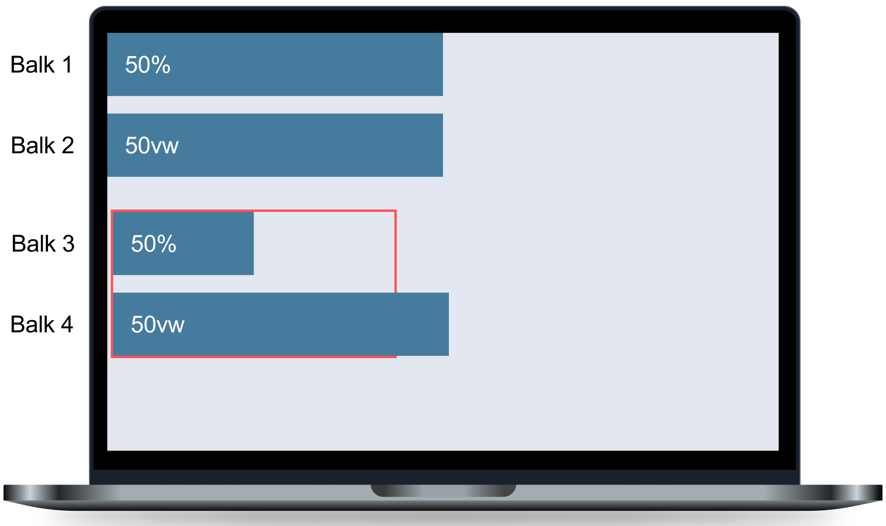
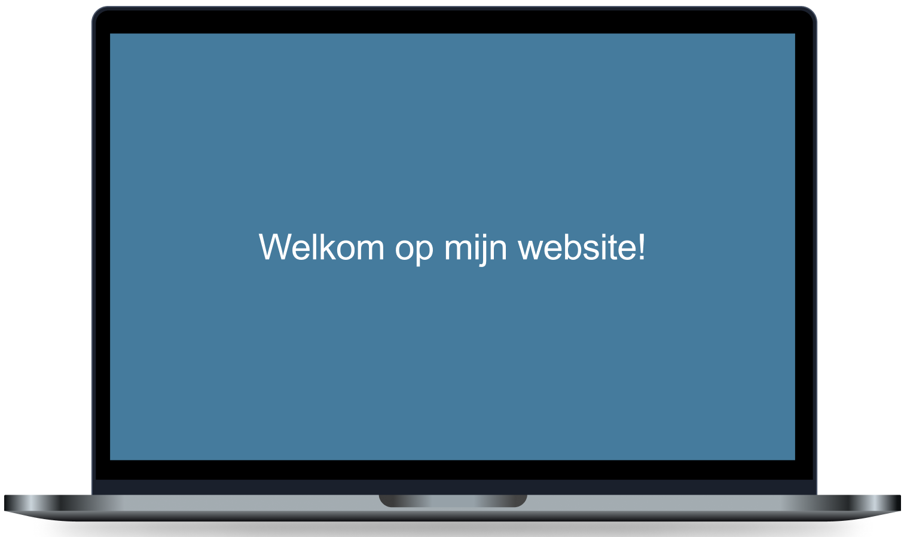
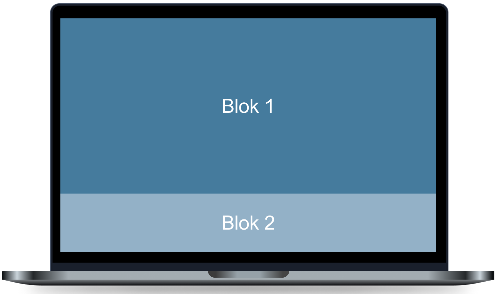
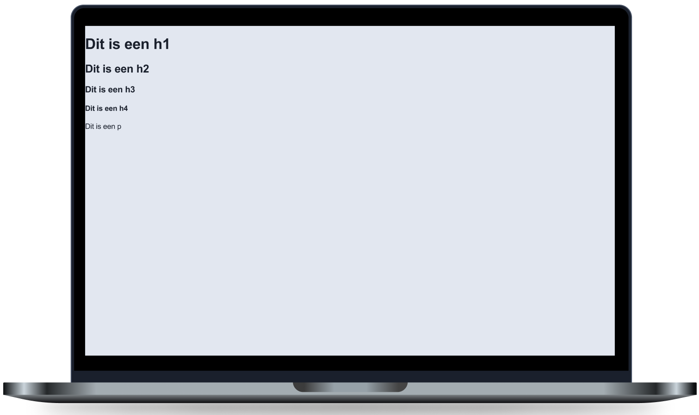

# Les 2 - Minipuzzels - Absolute & relatieve units

 

**Inhoudsopgave**
- [Les 2 - Minipuzzels - Absolute \& relatieve units](#les-2---minipuzzels---absolute--relatieve-units)
  - [Inleiding](#inleiding)
  - [Startcode downloaden](#startcode-downloaden)
    - [Hulpbronnen](#hulpbronnen)
  - [Minipuzzel 1](#minipuzzel-1)
  - [Minipuzzel 2](#minipuzzel-2)
  - [Minipuzzel 3](#minipuzzel-3)
  - [Minipuzzel 4](#minipuzzel-4)

 
 

## Inleiding
Voltooi onderstaande minipuzzels. Voor iedere oefening is er al code klaargezet in Brightspace die jij moet afronden. Let erop dat deze oefeningen alleen over CSS gaan. Dus je mag het HTML-bestand wel bekijken, maar schrijf alleen maar code in het CSS-bestand.

 

## Startcode downloaden

[Download de startcode uit Brightspace.](https://brightspace.hr.nl/d2l/le/lessons/110777/lessons/442865)

 

### Hulpbronnen
- [Video: Learn CSS Units In 8 Minutes](https://www.youtube.com/watch?v=-GR52czEd-0)

 
 

## Minipuzzel 1

Open de CSS van `Minipuzzel 1` en stel voor de balken de `width` in zoals op onderstaande afbeelding wordt getoond.

Balk 1 en 2 zijn beiden even breed, terwijl de eerste met `%` is ingesteld en de tweede met `vw`. Hoe kan dit?

Met `%` wordt de waarde relatief aan de parent bepaald en met `vw` relatief aan de viewport-width (dus het scherm). Balk 1 en 2 staan direct in de `<body>` en die is hier even breed als de viewport-width. Daarom zijn balk 1 en 2 even breed.

Balk 3 staat net als balk 1 ingesteld op `50%`, maar toch zie je verschil in breedte. Dit komt omdat balk 3 en 4 in een `<section>` staan met een breedte van `500px`. Zoals gezegd stel je met `%` de waarde relatief aan de parent in. Bij balk 1 is de parent de `<body>`, welke even breed is als het scherm. Bij balk 3 is de parent de `<section>` met een breedte van `500px`, waardoor balk 3 en breedte van `250px` krijgt.

Daarentegen blijft balk 4 even breed als balk 2, omdat deze relatief is aan de viewport-width en die blijft hetzelfde.

 
 

## Minipuzzel 2

Open de CSS van `Minipuzzel 2` en stel de `<header>` zo in dat hij even hoog is als het scherm, net zoals wordt getoond in onderstaan ontwerp. Hij mag dus niet lager of hoger zijn dan het scherm, hij moet exact dezelfde hoogte hebben.

 
 

## Minipuzzel 3

Open de CSS van `Minipuzzel 3` en stel de `<section>`'s zo in dat ze gezamenlijk even hoog zijn als het scherm, net zoals wordt getoond in onderstaan ontwerp. Ze mogen gezamenlijk dus niet lager of hoger zijn dan het scherm, ze moeten samen exact de hoogte van het scherm innemen.

 
 

## Minipuzzel 4

Open de CSS van `Minipuzzel 4` en geef ieder tekstelement een `font-size` met de unit `rem`.

Wanneer je dit voor alle tekstelementen hebt ingesteld, pas dan de `font-size` van `html` aan. Zorg ervoor dat dit wél een absolute waarde is, dus gebruik hiervoor `px`. Speel met deze waarde om te zien wat het effect hiervan is.

 
 

 

[Terug naar hoofdpagina](..)