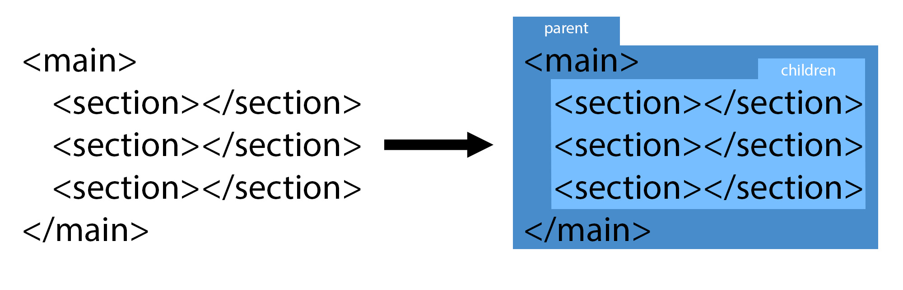
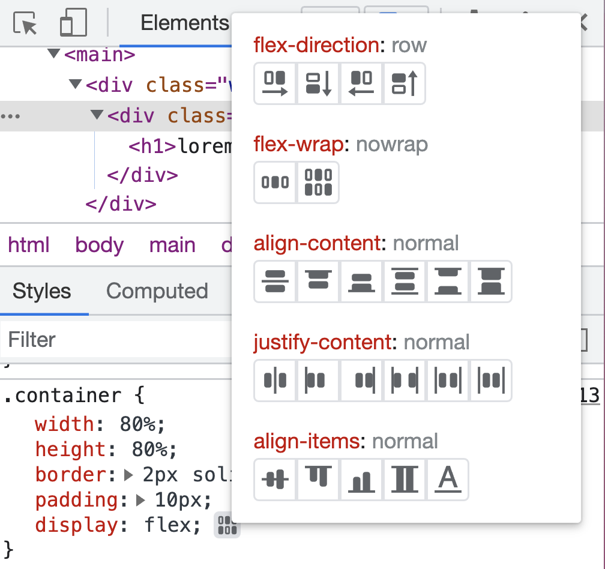
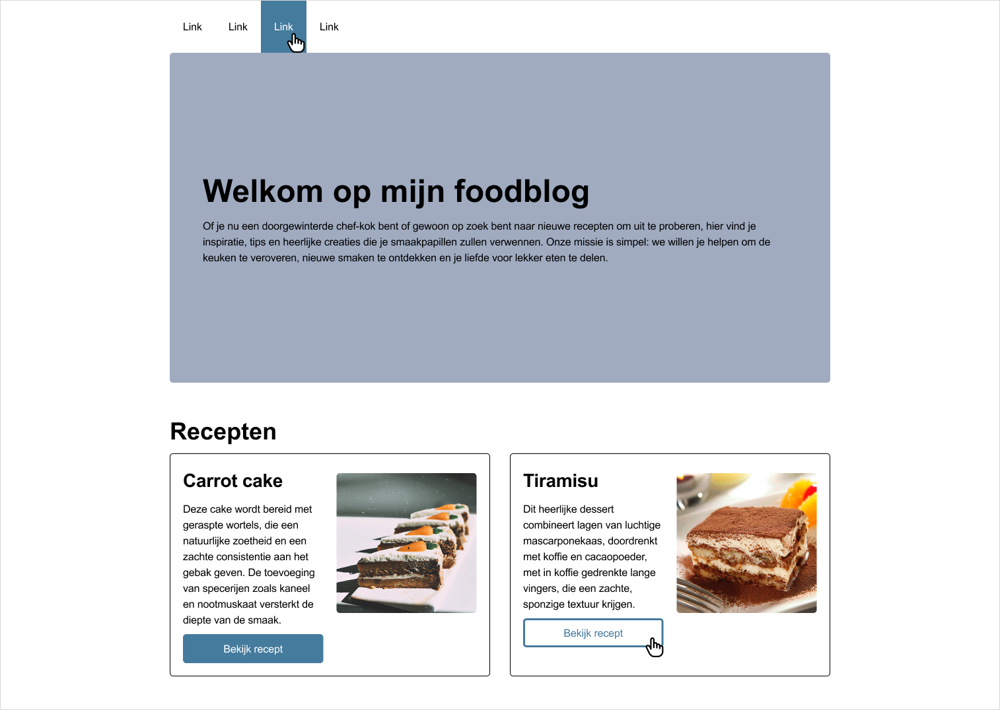
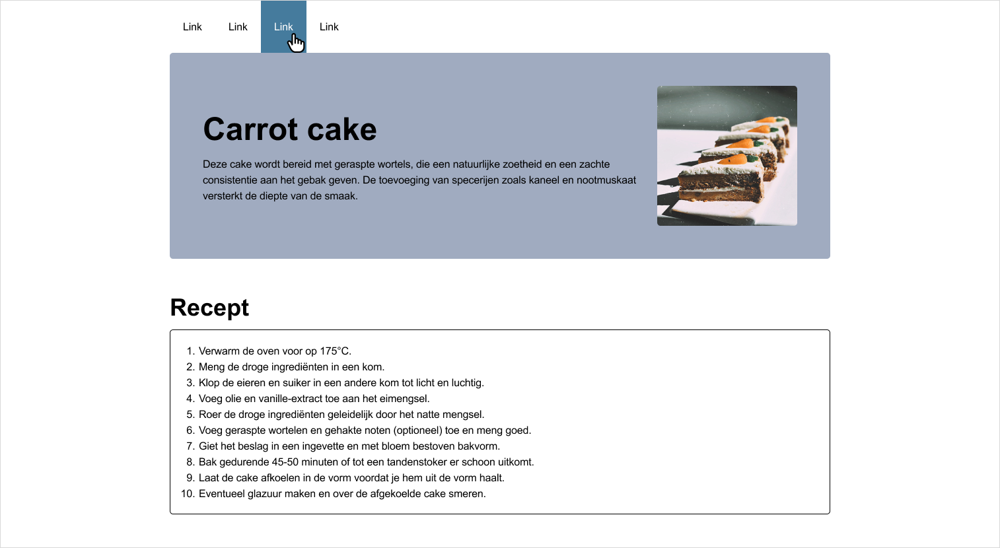
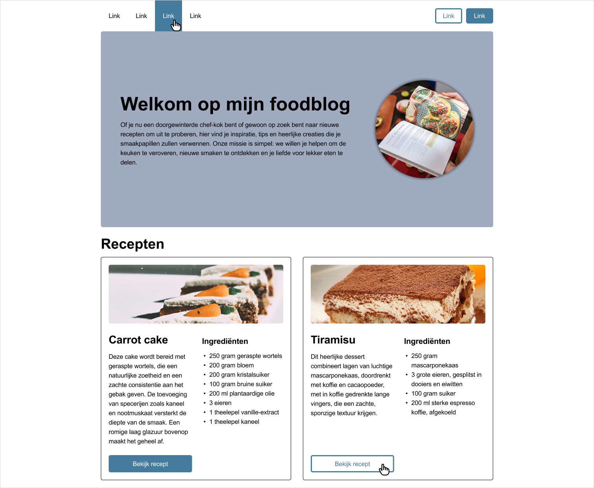

# Les 3

- [Les 3](#les-3)
- [Flexbox](#flexbox)
  - [Parent/child](#parentchild)
  - [Flexbox in een Flexbox](#flexbox-in-een-flexbox)
  - [Meest gebruikte Flexbox-opties](#meest-gebruikte-flexbox-opties)
  - [Flexbox-inspector 🔍](#flexbox-inspector-)
  - [Hulpbronnen voor Flexbox](#hulpbronnen-voor-flexbox)
- [Minipuzzels - Flexbox](#minipuzzels---flexbox)
- [Opdracht: Foodblog](#opdracht-foodblog)
  - [Advanced opdracht](#advanced-opdracht)

 
 

# Flexbox

In de afgelopen lessen heb je elementen alleen nog maar _onder elkaar_ gezet. Wil je de mogelijkheid om elementen ook
_naast elkaar_ te zetten? Dan kan je Flexbox gebruiken. Naast de mogelijkheid om elementen naast elkaar te zetten,
krijg je ook de mogelijkheid om de uitlijning van de elementen te bepalen. Kijk maar eens naar het volgende voorbeeld:

 
Met slechts 4 regels code van Flexbox krijg je het eindresultaat dat de drie elementen naast elkaar staan, dat er een ruimte tussen de elementen zit, dat ze als geheel de hele breedte vullen en dat element 1 dubbel zo groot is als element 2 en 3. Maar het volgende is bijvoorbeeld ook mogelijk:
  

 
Om dit eindresultaat te krijgen heb je zelfs maar 3 regels code van Flexbox nodig. Hopelijk krijg je hiermee al een eerste indruk wat de kracht van Flexbox is en dat je met weinig code totaal andere layouts kan maken dan je tot nu toe hebt gedaan.
 
Het is met Flexbox trouwens ook mogelijk om elementen weer onder elkaar te zetten met alle opties tot uitlijnen zoals je net hebt gelezen.

  

> Naast Flexbox heb je ook nog Grid. Deze techniek staat ook in de Expert-kolom in het beoordelingsmodel. Wil je hier
> meer over weten? Zie de [hulpbronnen bij de eindopdracht](../eindopdracht/).

 

## Parent/child

Zoals gezegd kan je met een paar regels code al veel voor elkaar krijgen met Flexbox, maar je moet wel eerst weten hoe
het werkt. Het begint met in de CSS een HTML-tag instellen als Flexbox. Al zijn directe _children_ kunnen vervolgens
naar wens worden ingesteld met de Flexbox-opties. Zie de afbeelding hieronder. Links in de afbeelding zie je de code
die we voor dit voorbeeld gebruiken: de `<main>` met daarin drie keer een `<section>`. In HTML-termen spreken we er nu
van dat de `<main>` de _parent_ is en de drie keer `<section>` die erin staan de _children_. Aan de rechterkant van
onderstaande afbeelding zie je deze parent/child relatie ook nog eens met kleuren uitgebeeld.

> De termen _parent_ en _children_ komen vaak terug bij HTML, dus onthoud ze goed!

## Flexbox in een Flexbox

Let erop dat in bovenstaand voorbeeld alleen de `<main>` een Flexbox is en dus alleen de drie children kunnen worden
vormgegeven met Flexbox. Dus stel, in de tweede `<section>` staat ook inhoud die je met Flexbox wil vormgeven, dan stel
je die `<section>` ook simpelweg in als Flexbox en dan heb je ook weer alle mogelijkheden. Zo krijg je dus een Flexbox,
in een Flexbox, in een Flexbox, etc. Dit is goed! We raden aan om zoveel mogelijk Flexbox te gebruiken om jouw layout
te bepalen.

 

## Meest gebruikte Flexbox-opties

De Flexbox-opties zijn in te delen in twee categorieën: _parent-opties_ en _child-opties_. Zoals de naam al verraadt
stel je de parent-opties in op de parent en heeft invloed op **alle** children. De child-opties stel je op de children
zelf in en heeft alleen invloed op de children waarop je het instelt.

 

**Flexbox-opties parent**

| Optie           | Omschrijving                                                                                                                               | Voorbeeld                                                                           |
| --------------- | ------------------------------------------------------------------------------------------------------------------------------------------ | ----------------------------------------------------------------------------------- |
| display: flex;  | Hiermee stel je een HTML-tag in als Flexbox.                                                                                               | display: flex;                                                                      |
| flex-direction  | Instellen of de children in een rij of kolom getoond moeten worden.                                                                        | flex-direction: column;       |
| justify-content | Bepaalt de uitlijning op de hoofdas (dus de richting die gekozen is bij `flex-direction`).                                                 | justify-content: center;     |
| align-items     | Bepaalt de uitlijning op de dwars-as (dus het tegenovergestelde van wat gekozen is bij `flex-direction`).                                  | align-items: flex-end;           |
| flex-wrap       | Bepaalt of de Flexbox op één rij moet blijven, of zich mag verdelen over meerdere rijen.                                                   | flex-wrap: wrap;                   |
| align-content   | Wanneer flex-wrap op `wrap` staat en de content valt over meerdere rijen, is met deze optie de uitlijning tussen deze rijen in te stellen. | align-content: space-between;  |
| gap             | Bepaalt de ruimte tussen de children.                                                                                                      | gap: 20px;                               |

 

**Flexbox-opties child**

| Optie       | Omschrijving                                                                                             |                                                                          |
| ----------- | -------------------------------------------------------------------------------------------------------- | ------------------------------------------------------------------------ |
| flex-grow   | Bepaalt hoeveel deze child mag groeien t.o.v. de andere children.                                        | flex-grow: 2;           |
| flex-shrink | Bepaalt hoeveel deze child mag krimpen t.o.v. de andere children.                                        | flex-shrink: 1;                                                          |
| flex-basis  | Bepaalt de standaardgrootte van de child voordat de resterende ruimte wordt verdeeld.                    | flex-basis: 200px;                                                       |
| flex        | Dit is de shorthand-notatie van bovenstaande drie opties. **Het wordt aangeraden om deze te gebruiken.** | flex: 1;                                                                 |
| align-self  | Deze optie werkt hetzelfde als align-items, maar wordt hier alleen toegepast op het specifieke child.    | align-self: flex-end;  |

Voor het volledige overzicht,
[zie deze documentatie](https://css-tricks.com/snippets/css/a-guide-to-flexbox/#aa-flexbox-properties).

 

## Flexbox-inspector 🔍

Om erachter te komen wat er allemaal mogelijk is met Flexbox gebruik je de `inspector`. Hierin kun je namelijk met
simpelweg drukken op knopjes veel parent-opties uitproberen. Inspecteer een HTML-tag die staat ingesteld als Flexbox en
klik rechts van `display: flex` op het Flexbox-knopje. Voor meer info, bekijk de volgende video:
[https://developer.chrome.com/docs/devtools/css/flexbox/](https://developer.chrome.com/docs/devtools/css/flexbox/)

 

> Reminder: je opent de inspector door met de rechter muistoets op een specifiek HTML-element te klikken en vervolgens
> op **Inspecteren**, óf met de sneltoets ⌥⌘i op Mac en F12 op Windows.

 

## Hulpbronnen voor Flexbox

- [Flexbox basics cheatsheet](./images/flex-cheatsheet.pdf) 
- [A Complete Guide to Flexbox](https://css-tricks.com/snippets/css/a-guide-to-flexbox/)
- [Video: CSS Flexbox in 100 Seconds](https://www.youtube.com/watch?v=K74l26pE4YA)
- [Video waarin flex-grow, flex-shrink en flex-basis wordt uitgelegd met voorbeelden](https://www.youtube.com/watch?v=CFgeJq4l1YM)

   **Klaar met het hoofdstuk over Flexbox?**  
[Klik dan hier om naar de minipuzzels over Flexbox te gaan.](minipuzzels/flexbox/)

 
 

# Minipuzzels - Flexbox

[Klik hier om naar de minipuzzels over Flexbox te gaan.](minipuzzels/flexbox/)

 
 

# Opdracht: Foodblog

Download de startcode als je dat nog niet had gedaan
([zie Brightspace](https://brightspace.hr.nl/d2l/le/lessons/110777/lessons/442865)) en bouw vervolgens het volgende
ontwerp na _(klik op de afbeelding om te vergroten)_.

Let op, het gaat om twee pagina's: de homepage met recepten en de detailpagina van een recept. Wanneer er op de
homepage wordt geklikt op **Bekijk recept** moet er dus naar de detailpagina worden genavigeerd.   De
receptomschrijving op de detailpagina moet een échte lijst zijn. Gebruik hiervoor de tag `<ol>`.

Ook hierbij geldt weer: wanneer er een handje op een linkje wordt getoond, dan wordt de hover-state getoond.

Voor deze opdracht heb je de volgende kleurcodes nodig:

| Hex       | RGB                  |
| --------- | -------------------- |
| `#000000` | `rgb(0,0,0)`         |
| `#FFFFFF` | `rgb(255,255,255)`   |
| `#457B9D` | `rgb(69,123,157)`    |
| `#A0ABC0` | `rgb(160, 171, 192)` |

 

**Homepage**   

 

**Detailpagina recept**   

 

## Advanced opdracht

Als je wat extra uitdaging wilt, dan kan je ook onderstaande wireframe nabouwen. Hierin zitten extra elementen die je
door zelfstudie moet zien te achterhalen. De afbeeldingen zijn te vinden in de startcode
([zie Brightspace](https://brightspace.hr.nl/d2l/le/lessons/110777/lessons/442865)). Je mag de startcode gebruiken,
maar je mag ook alles zelf maken.

Let op, ook bij deze opdracht gaat het om twee pagina's: de homepage met recepten en de detailpagina van een recept. De
detailpagina is dezelfde als bij de reguliere opdracht, maar hij staat ook hieronder nog weergegeven. Wanneer er op de
homepage wordt geklikt op **Bekijk recept** moet er dus naar de detailpagina worden genavigeerd

Zorg er tot slot ook voor dat de knoppen **Bekijk recept** netjes tegen de onderkant uitlijnen, zoals ook in het
ontwerp te zien is.

 

**Homepage advanced**   

**Detailpagina recept**   
