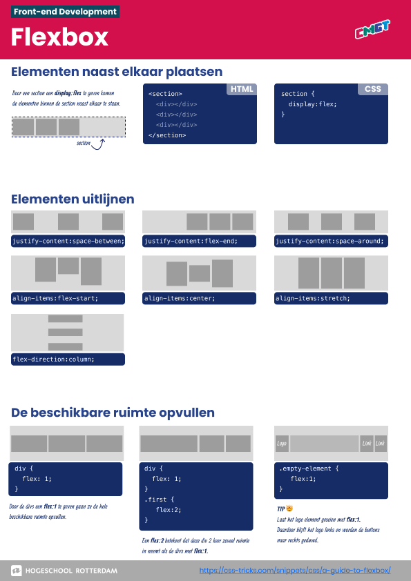
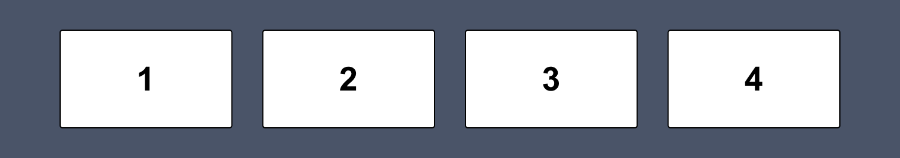
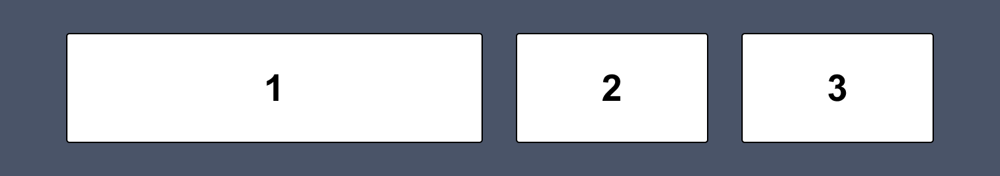
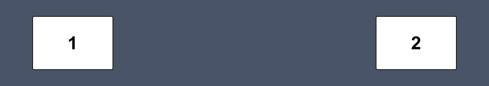
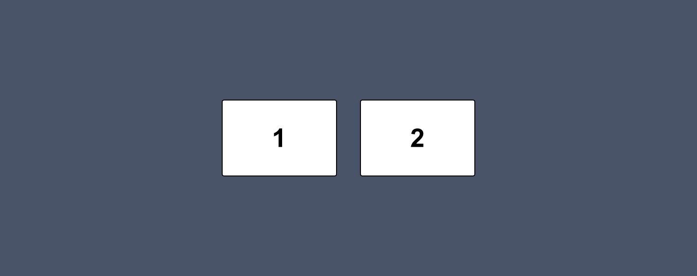
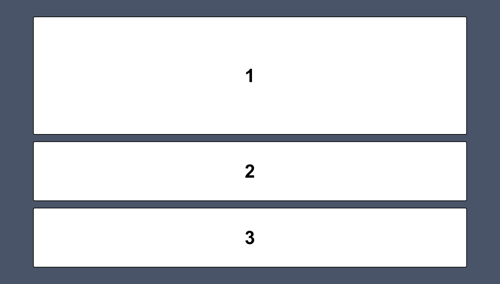
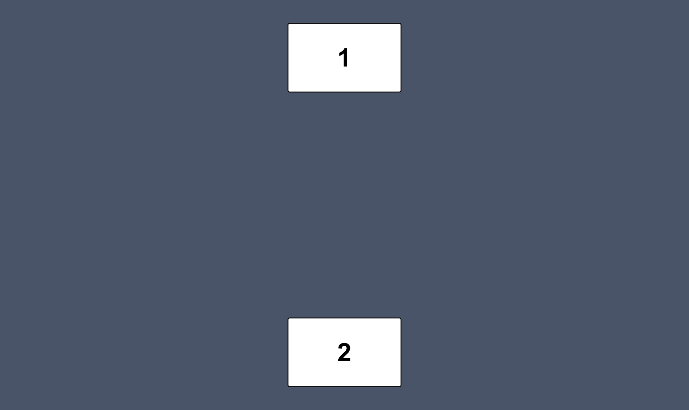
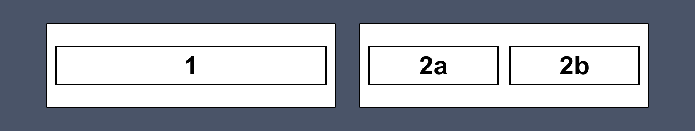
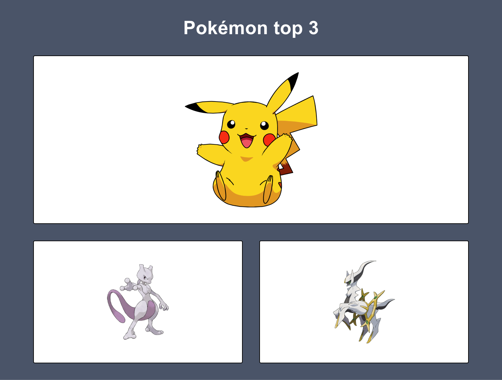

# Les 3 - Minipuzzels - Flexbox

 

**Inhoudsopgave**
- [Les 3 - Minipuzzels - Flexbox](#les-3---minipuzzels---flexbox)
  - [Inleiding](#inleiding)
  - [Startcode downloaden](#startcode-downloaden)
  - [Minipuzzel 1](#minipuzzel-1)
  - [Minipuzzel 2](#minipuzzel-2)
  - [Minipuzzel 3](#minipuzzel-3)
  - [Minipuzzel 4](#minipuzzel-4)
  - [Minipuzzel 5](#minipuzzel-5)
  - [Minipuzzel 6](#minipuzzel-6)
  - [Minipuzzel 7](#minipuzzel-7)
  - [Minipuzzel 8](#minipuzzel-8)

   

## Inleiding
Voltooi onderstaande minipuzzels. Voor iedere oefening is er al code klaargezet die jij moet afronden. Let erop dat deze oefeningen alleen over CSS gaan. Dus je mag het HTML-bestand wel bekijken, maar schrijf alleen maar code in het CSS-bestand.

 

## Startcode downloaden

[Download de startcode uit Brightspace.](https://brightspace.hr.nl/d2l/le/lessons/110777/lessons/442865)

 

**Hulpbronnen voor de minipuzzels**

- [Flexbox basics cheatsheet](../../images/flex-cheatsheet.pdf) 
- [A Complete Guide to Flexbox](https://css-tricks.com/snippets/css/a-guide-to-flexbox/)
- [Video waarin flex-grow, flex-shrink en flex-basis wordt uitgelegd](https://www.youtube.com/watch?v=CFgeJq4l1YM)

   

## Minipuzzel 1

Bouw het volgende ontwerp na:

   

## Minipuzzel 2

Bouw het volgende ontwerp na:

   

## Minipuzzel 3

Bouw het volgende ontwerp na:

   

## Minipuzzel 4

Bouw het volgende ontwerp na:

   

## Minipuzzel 5

Bouw het volgende ontwerp na:

   

## Minipuzzel 6

Bouw het volgende ontwerp na:

   

## Minipuzzel 7

In het volgende ontwerp zie je een `Flexbox in een Flexbox`, ook wel een `nested Flexbox` genoemd. Het is als volgt opgebouwd:

- In de eerste Flexbox staan de twee witte `<section>`'s naast elkaar;
- In de tweede `<section>` staat een Flexbox met daarin de twee cijfers `2a` en `2b` naast elkaar.

 

Bouw het volgende ontwerp na:

   

## Minipuzzel 8

In het volgende ontwerp zie je een `Flexbox in een Flexbox`, ook wel een `nested Flexbox` genoemd. Het is als volgt opgebouwd:

- In de eerste Flexbox staan de twee witte `<section>`'s naast elkaar;
- In de tweede `<section>` staat een Flexbox met daarin de twee cijfers `2a` en `2b` naast elkaar.

 

Bouw het volgende ontwerp na:

 

[Terug naar hoofdpagina](../..)
