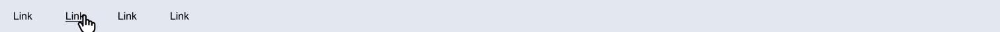
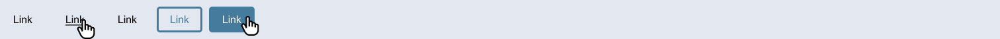

# Les 3 - Minipuzzels - Navigatie

 

**Inhoudsopgave**

- [Les 3 - Minipuzzels - Navigatie](#les-3---minipuzzels---navigatie)
  - [Inleiding](#inleiding)
  - [Belangrijke informatie!](#belangrijke-informatie)
  - [Startcode downloaden](#startcode-downloaden)
  - [Minipuzzel 1](#minipuzzel-1)
  - [Minipuzzel 2](#minipuzzel-2)
  - [Minipuzzel 3](#minipuzzel-3)
  - [Minipuzzel 4](#minipuzzel-4)

 
 

## Inleiding

Voltooi onderstaande minipuzzels. Voor iedere oefening is er al code klaargezet die jij moet afronden.

## Belangrijke informatie!

- Voor deze oefeningen moet je zowel HTML als CSS schrijven;
- Op de linkjes waar een handje staat wordt de hover-state weergeven, die je ook moet maken in de CSS;
- Voor deze oefeningen mag je iedere `<a>` op `href="#"` instellen;
- Je hebt voor iedere mini-oefening in de CSS de optie `text-decoration` nodig.

Verder heb je de volgende kleurcodes nodig voor deze oefeningen:

| Hex       | RGB                |
| --------- | ------------------ |
| `#000000` | `rgb(0,0,0)`       |
| `#FFFFFF` | `rgb(255,255,255)` |
| `#457B9D` | `rgb(69,123,157)`  |

 

## Startcode downloaden

<a href="https://brightspace.hr.nl/d2l/le/lessons/110777/lessons/442865" target="_blank">Download de startcode uit
Brightspace.</a>

  

## Minipuzzel 1

In de startmap `minipuzzels/navigatie/oefening1` staat code klaar om te oefenen met het stylen van `<a>`. In de HTML
staat een stuk gegenereerde tekst klaar met daarin meerdere linkjes. In de CSS staan alle mogelijke selectors al klaar.
Stel voor iedere selector een `color` in en bekijk in de browser wat het effect daarvan is. Speel ook met andere
waarden, zoals `background-color` en `text-decoration`.

   

## Minipuzzel 2

Bouw het volgende ontwerp na _(klik op de afbeelding om te vergroten)_:

   

## Minipuzzel 3

Bouw het volgende ontwerp na _(klik op de afbeelding om te vergroten)_:

   

## Minipuzzel 4

Bouw het volgende ontwerp na _(klik op de afbeelding om te vergroten)_:

 

<a href="../.." target="_blank">Terug naar hoofdpagina</a>
