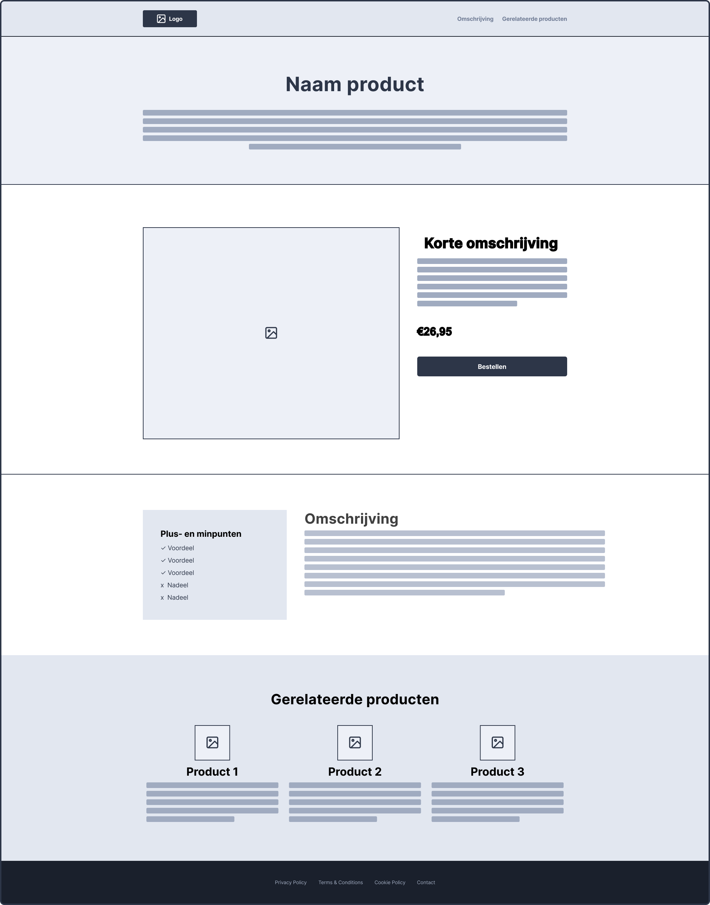

# Les 4

**Inhoudsopgave**

- [Les 4](#les-4)
  - [Leerdoelen](#leerdoelen)
- [Flexbox Froggy 🐸](#flexbox-froggy-)
- [Minipuzzels - Nested Flexbox](#minipuzzels---nested-flexbox)
- [Navigatie](#navigatie)
  - [HTML voor de navigatie](#html-voor-de-navigatie)
  - [CSS voor de navigatie](#css-voor-de-navigatie)
  - [Minipuzzels - Navigatie](#minipuzzels---navigatie)
- [Google Fonts](#google-fonts)
- [De tussenopdracht](#de-tussenopdracht)
  - [Stap 1: Nieuw project aanmaken](#stap-1-nieuw-project-aanmaken)
  - [Stap 2: Wireframe nabouwen](#stap-2-wireframe-nabouwen)
    - [Van wireframe naar ontwerp](#van-wireframe-naar-ontwerp)

<br><br><br>

## Leerdoelen

In deze les ligt de focus op de volgende leerdoelen:

| Leerdoel                                                                                                                | Toelichting                                                                                                |
| ----------------------------------------------------------------------------------------------------------------------- | ---------------------------------------------------------------------------------------------------------- |
| 1. Ik kan de relatie tussen HTML en CSS uitleggen en kan hiermee een semantische en toegankelijke webpagina bouwen.     | In deze les leer je wat de semantische tags zijn voor een navigatie en hoe je deze met CSS kunt vormgeven. |
| 2. Ik kan uitleggen hoe een layout tot stand komt in de browser en kan een responsive webpagina bouwen met HTML en CSS. | In deze les leer je wat nested Flexbox is en hoe je hiermee complexere layouts kunt bouwen.                |

<br>

Alle leerdoelen zijn terug te vinden in de [cursushandleiding](https://brightspace.hr.nl/d2l/home/192811) @TODO: juiste
link invoeren.

<br><br><br>

# Flexbox Froggy 🐸

[Flex je skills met de flexbox froggy game](https://flexboxfroggy.com)

<br><br><br>

# Minipuzzels - Nested Flexbox

[Klik hier om naar de minipuzzels over nested Flexbox te gaan.](minipuzzels/nested-flexbox/)

<br><br><br>

# Navigatie

In de vorige lessen heb je al vaker met `<nav>` gewerkt en in deze les duiken we daar dieper op in. Je weet al dat je
in de `<nav>` een `<a>` invoert voor ieder linkje die je wilt tonen. Maar hoe stel je dit linkje correct in? En hoe kan
je deze vormgeven? Dat leer je in deze les.

<br>

## HTML voor de navigatie

Allereerst: wat is een `<a>` eigenlijk? Het doel van deze HTML-tag is dat de gebruiker erop kan klikken en dat die naar
een ander stukje content wordt gebracht. Dus stel, je bent op een webshop en je wilt alle producten bekijken, dan klik
je in het hoofdmenu (wat dus een `<nav>` is) op het linkje _Producten_ (wat dus een `<a>` is), zodat je naar die
betreffende pagina wordt gebracht.

De HTML van een navigatie ziet er doorgaans ongeveer als volgt uit:

```html
<nav>
  <a href="#">Link 1</a>
  <a href="#">Link 2</a>
  <a href="#">Link 3</a>
</nav>
```

Je begint met de `<nav>` met daarin één of meerdere `<a>`'s. Tot zover niets nieuws, dit heb je al meerdere malen
gemaakt. Je ziet bij het attribuut `href` nu een `#` staan in dit voorbeeld. Op die plek komt de daadwerkelijke link te
staan waarnaar genavigeerd moet worden. Dus waar de gebruiker naartoe moet worden gestuurd wanneer die op de `<a>`
klikt. Hiervoor heb je twee opties die hieronder worden toegelicht.

<br>

**Linken binnen dezelfde pagina** <br> Het is mogelijk om te linken naar een onderdeel op dezelfde pagina. Dus stel, er
staan drie secties op jouw pagina, dan zou je in de navigatie per sectie een `<a>` in de `<nav>` kunnen plaatsen. Dit
is vooral handig bij hele lange pagina's, zodat je gemakkelijk van de ene sectie naar de andere kan klikken. Een
voorbeeld van de code hiervoor vind je terug in de [Cheatsheet HTML & CSS](../les1/cheatsheet/Cheatsheet-HTML-CSS.pdf)
op pagina 2.

<br>

**Linken naar een andere pagina** <br> Het is ook mogelijk om te linken naar een andere pagina. Dit kan een pagina van
dezelfde website zijn, maar ook van een andere. De meeste websites bevatten meerdere pagina's. Zo heb je bijvoorbeeld
vaak een homepage, een over-ons-pagina en een contactpagina. De navigatie voor een website met deze drie pagina's zou
er als volgt uit kunnen zien:

```html
<nav>
  <a href="index.html">Home</a>
  <a href="over-ons.html">Over ons</a>
  <a href="contact.html">Contact</a>
</nav>
```

Hier zie je bijvoorbeeld dat bij het linkje naar de contactpagina de `href` staat ingesteld op `contact.html`. Dit
betekent dat er in jouw project ook een bestand moet staan die `contact.html` heet en die wordt dan geopend wanneer je
op het linkje klikt.

Bij het linkje voor de homepage zie je in de `href` overigens `index.html` staan, hierin staat namelijk de homepage.

Tot slot, wanneer je een link wilt leggen naar een andere website, dan moet je de volledige URL invoeren, dus vanaf
`https://`. Ook is het aan te raden om deze _externe link_ in een nieuw tabje te openen, zodat jouw eigen website ook
nog in een tabje open blijft staan. Dit stel je in met het attribuut `target` en de waarde moet dan `_blank` zijn. Dus
stel, je wilt een linkje maken die naar de website van CMGT gaat, dan zou dat er als volgt uitzien:

```html
<a href="https://cmgt.hr.nl/" target="_blank">Google</a>
```

<br>

## CSS voor de navigatie

Het vormgeven van de `<nav>` werkt zoals met iedere andere HTML-tag, maar de `<a>` heeft enkele uitzonderingen die hier
worden uitgelegd. Het is namelijk belangrijk om te weten dat een `<a>` verschillende _states_ heeft. Dit betekent dat
je afhankelijk van de situatie de `<a>` een andere styling kan geven. Het gaat om de volgende states:

- Standaard: de normale state wanneer geen andere van toepassing is;
- hover: wanneer de muisaanwijzer op de link is geplaatst (zonder te klikken);
- active: tijdens het klikken op de link;
- visited: wanneer de link al eerder aangeklikt is;
- focus: wanneer de focus op het linkje staat, meestal doordat je met de tabtoets door de pagina heen gaat.

Bovenstaande states kun je in de CSS selecteren door het gebruik van zogenaamde _pseudo-classes_. Deze classes hoef je
niet handmatig in de HTML in te voeren, maar krijgt de HTML-tag vanzelf. Meer info is
[hier te lezen op W3Schools](https://www.w3schools.com/css/css_pseudo_classes.asp). Zo'n pseudo-class geef je in de CSS
met een `:` aan. In het volgende voorbeeld zie je hoe je de kleur van de `<a>` kan veranderen wanneer je muisaanwijzer
erop staat:

```css
a:visited {
  color: red;
}

a:hover {
  color: blue;
}

a:active {
  color: purple;
}
```

<br><br><br>

## Minipuzzels - Navigatie

[Klik hier om naar de minipuzzels over navigatie te gaan.](minipuzzels/navigatie/)

<br><br><br>

# Google Fonts

Doorloop de volgende stappen om een font van Google te gebruiken:

1. Ga naar [https://fonts.google.com/](https://fonts.google.com/);
2. Vind de font die je wilt gebruiken en klik erop;
3. Scroll naar de verschillende fontstijlen die beschikbaar zijn en klik rechts op het plusje bij de fontstijlen die je
   wilt gebruiken (klik ze niet zomaar allemaal aan, want hoe meer je er kiest, hoe langer het duurt om jouw pagina te
   laden);
4. Klik rechts bovenin op het winkelmandje, selecteer de optie `@import` en kopieer de code die daar staat (zonder de
   `<style>` tag) en plak deze bovenin jouw CSS-bestand;
5. Scroll in het winkelmandje nog iets verder naar het kopje `CSS rules to specify families` en kopieer de benodigde
   CSS-code en plak deze bij de gewenste selector in je CSS-bestand.

<br><br><br>

# De tussenopdracht

De informatie over de opdracht, het inleveren en de voorwaarden zijn te vinden in de **_cursushandleiding_**.

<br>

## Stap 1: Nieuw project aanmaken

Je hebt in les 1 al een project aangemaakt waarin je alle lesopdrachten maakt. Deze map heb je waarschijnlijk
`frontend-development` genoemd. De tussenopdracht waar je vandaag aan gaat beginnen moet je zien als een los project en
moet dus ook in een eigen map. Je kan hiervoor [opdracht 1c van les 1](../les1/#opdracht-1c---eerste-project-aanmaken)
volgen, maar noem de map die je aanmaakt dan `frontend-tussenopdracht`. Zet vervolgens de standaard bestandsstructuur
neer (zoals uitgelegd wordt in [opdracht 1d van les 1](../les1/#opdracht-1d---bestandsstructuur-html-en-css)).

<br>

## Stap 2: Wireframe nabouwen

De opdracht is om onderstaande wireframe na te bouwen, **_zoals omschreven in de cursushandleiding_**. <br>

### Van wireframe naar ontwerp

- Bedenk waar jouw website over gaat.
- Gebruik _teksten_ en _afbeeldingen_ die logisch zijn bij jouw onderwerp.
- Kies zelf bijpassende kleuren. Maak eventueel gebruik van een kleurpalet zoals
  [coolors](https://coolors.co/palettes/palettes) of [Realtime Colors](https://www.realtimecolors.com/).
- Kies bijpassende fonts. Tip: gebruik een fancy font voor grote kopteksten, en een prettig leesbaar font voor
  bodyteksten.
- ⚠️ Gebruik voor deze opdracht geen copilot om code te genereren, maar vragen stellen mag altijd!

<br>

Hieronder staan nog enkele tips om je hierbij te helpen.

> ### Tips voor het bouwen
>
> - Bouw eerst de basisstructuur op met `semantic` tags;
> - Bouw één voor één de rijen na, in plaats van alles tegelijk op te willen lossen;
> - Gebruik `display:flex` om elementen naast elkaar te zetten;
> - Hou de `flex-documentatie` bij de hand, en gebruik de `flex-inspector` in je browser.
> - Je mag `<div>` gebruiken om binnen sections containers aan te maken, wanneer je dit puur voor de styling nodig
>   hebt;
> - Gebruik `padding` om witruimte toe te voegen binnen je containers.
> - Ruimte buiten de containers voeg je toe met `flex` eigenschappen zoals `gap` en `justify-content`. Als je container
>   geen onderdeel van flex layout is, dan gebruik je `margin`.
> - Je kan de hele opdracht oplossen met de stof uit de lessen, je hebt geen google/stackoverflow/chatgpt nodig.
> - Als iets niet lukt kan je je medestudenten, peercoaches en docenten om hulp vragen!

<br>



[Download: Wireframe tussenopdracht PDF](https://github.com/HR-CMGT/frontend-2023-2024/files/12676336/wireframe-tussenopdracht.pdf)
