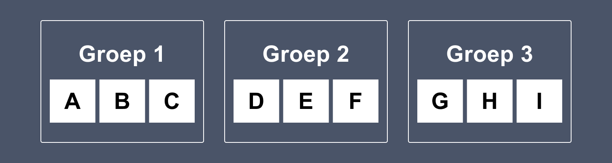
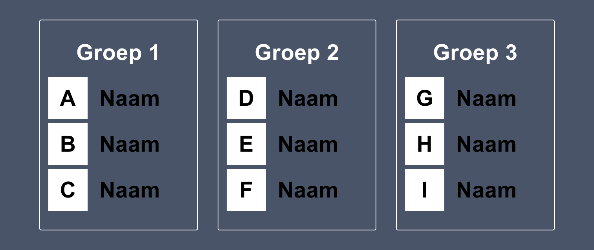

# Les 4 - Minipuzzels - Nested Flexbox

 

**Inhoudsopgave**

- [Les 4 - Minipuzzels - Nested Flexbox](#les-4---minipuzzels---nested-flexbox)
  - [Inleiding](#inleiding)
  - [Startcode downloaden](#startcode-downloaden)
  - [Minipuzzel 1](#minipuzzel-1)
  - [Minipuzzel 2](#minipuzzel-2)

   

## Inleiding

In de vorige les heb je al minipuzzels gemaakt over Flexbox. Onderstaande minipuzzels gaan ook over Flexbox, maar gaan
een stapje verder. De focus ligt vooral op `nested Flexbox`, dus een Flexbox in een Flexbox. Voor iedere oefening is er
al code klaargezet die jij moet afronden. Let erop dat deze oefeningen alleen over CSS gaan. Dus je mag het
HTML-bestand wel bekijken, maar schrijf alleen maar code in het CSS-bestand.

 

## Startcode downloaden

[Download de startcode uit Brightspace.](https://brightspace.hr.nl/d2l/le/lessons/192811/lessons/847308)

 

## Minipuzzel 1

In onderstaand ontwerp zijn twee Flexboxes te vinden:

- de drie groepen die naast elkaar staan;
- in iedere groep staan de drie letters naast elkaar.

 

Bouw onderstaand ontwerp na.

   

## Minipuzzel 2

In onderstaand ontwerp is nóg een laag dieper gebruik gemaakt van Flexbox, namelijk:

- de drie groepen die naast elkaar staan;
- in iedere groep staan de drie letters in dit geval onder elkaar;
- naast iedere letter staat nu ook een naam.

 

Bouw onderstaand ontwerp na.

 

[Terug naar hoofdpagina](../..)
