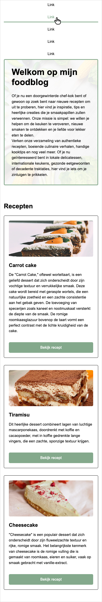
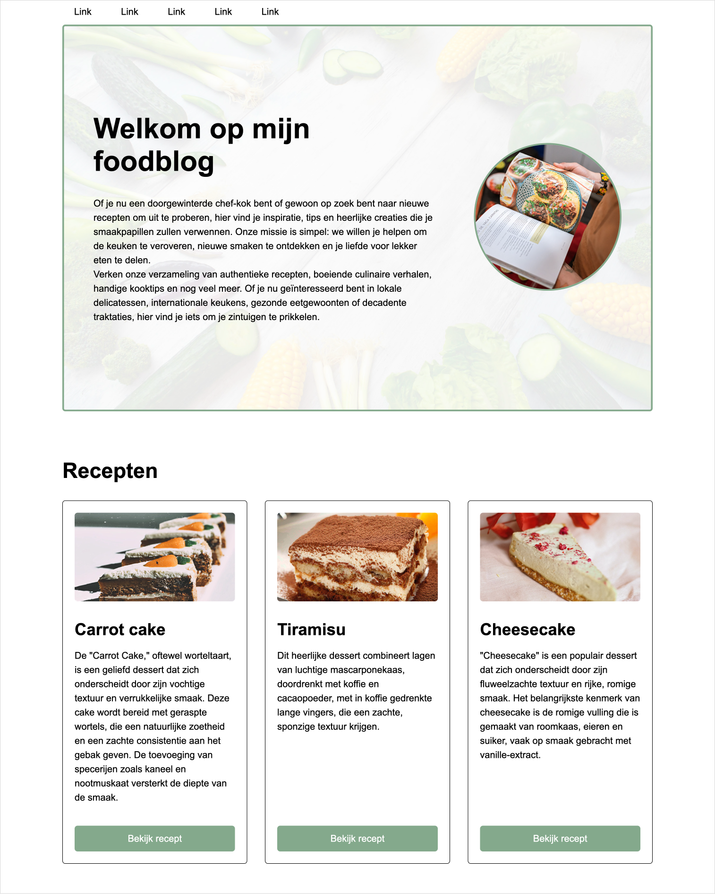

# Les 5

> _"A Pixel is Not a Pixel"_

<br>

**Inhoudsopgave**

- [Les 5](#les-5)
  - [Leeruitkomsten](#leeruitkomsten)
- [Responsive design](#responsive-design)
  - [Meta viewport](#meta-viewport)
  - [Absolute en relatieve units](#absolute-en-relatieve-units)
  - [Box sizing](#box-sizing)
  - [Calc](#calc)
  - [Media queries](#media-queries)
  - [Flex columns](#flex-columns)
- [Afbeeldingen](#afbeeldingen)
  - [Formaten](#formaten)
  - [Schalen](#schalen)
  - [Object fit](#object-fit)
  - [Achtergrondafbeeldingen](#achtergrondafbeeldingen)
- [Expert: Afbeeldingen aanpassen voor device](#expert-afbeeldingen-aanpassen-voor-device)
  - [Verschillende DPI waarden](#verschillende-dpi-waarden)
  - [Werken met picture](#werken-met-picture)
  - [Links](#links)
- [Opdracht: Foodblog responsive](#opdracht-foodblog-responsive)
  - [Eindresultaat mobile](#eindresultaat-mobile)
  - [Eindresultaat desktop](#eindresultaat-desktop)

<br><br><br>

## Leeruitkomsten

In deze les ligt de focus op de volgende leeruitkomst:

| Leeruitkomst                                                                                                            | Toelichting                                                                 |
| ----------------------------------------------------------------------------------------------------------------------- | --------------------------------------------------------------------------- |
| 2. Ik kan uitleggen hoe een layout tot stand komt in de browser en kan een responsive webpagina bouwen met HTML en CSS. | In deze les leer je wat ervoor nodig is om een website responsive te maken. |

<br>

Alle leeruitkomsten zijn terug te vinden in de [cursushandleiding](https://brightspace.hr.nl/d2l/home/192811) @TODO:
juiste link invoeren.

<br><br><br>

# Responsive design

- meta-viewport
- Werken met absolute en relatieve units
- Media queries
- Flex row naar flex column

<br>

## Meta viewport

```html
<meta name="viewport" content="width=device-width, initial-scale=1" />
```

<br>

## Absolute en relatieve units

Hieronder vind je de tabel met de meestgebruikte units.

| Naam unit | Type     | Omschrijving                                                                                                                                                      | Voorbeeld            |
| --------- | -------- | ----------------------------------------------------------------------------------------------------------------------------------------------------------------- | -------------------- |
| `px`      | Absoluut | Hiermee bepaal je exact hoeveel pixels op je scherm er gebruikt moeten worden.<br> ⚠️ _Gebruik alleen `px` wanneer geen van onderstaande volstaat._               | `width: 200px;`      |
| `%`       | Relatief | Hiermee wordt de waarde bepaald op basis van de breedte of hoogte van de `parent`.                                                                                | `width: 100%;`       |
| `vw`      | Relatief | Hiermee wordt de waarde bepaald op basis van de `breedte` van de viewport (het zichtbare deel van de browser).                                                    | `width: 50vw;`       |
| `vh`      | Relatief | Hiermee wordt de waarde bepaald op basis van de `hoogte` van de viewport (het zichtbare deel van de browser).                                                     | `height: 100vh;`     |
| `rem`     | Relatief | Hiermee wordt de waarde bepaald op basis van de `root font-size`, oftewel de font-size die op de `<html>` staat ingesteld. Gebruik voor `font-size` altijd `rem`. | `font-size: 1.5rem;` |
| `em`      | Relatief | Hiermee wordt de waarde bepaald op basis van de `font-size` van het parent-element.<br> ⚠️ _Gebruik liever `rem` dan `em` omdat die makkelijker te gebruiken is._ | `font-size: 2em;`    |

De vraag die je jezelf iedere keer weer moet stellen is:

> Op basis van **_wat_** moet ik de grootte bepalen?

- Stel, je wilt de `width` van een `section` instellen. Moet deze dan relatief zijn aan de parent (`%`) of aan het hele
  scherm (`vw`)?
- Of je wilt de `height` van de `header` instellen. Moet deze dan relatief zijn aan de hoogte van het scherm (`vh`) of
  moet deze altijd hetzelfde zijn op ieder scherm (`px`)?

Door deze vragen te beantwoorden, kun je de juiste CSS units kiezen en ervoor zorgen dat je ontwerp zowel flexibel als
consistent is op verschillende apparaten en schermformaten. Experimenteer met verschillende units om te begrijpen hoe
ze zich gedragen in verschillende situaties en kies de meest geschikte unit voor elke specifieke toepassing.

[Kijk voor voorbeelden hiervan terug naar het hoofdstuk hierover in les 2.](../les2/#voorbeelden)

<br>

## Box sizing

Bij het bepalen van de afmetingen van je elementen kan het verwarrend zijn dat de `border` en `padding` niet
automatisch worden meegenomen in de berekening. Dit kan je corrigeren met:

```css
* {
  box-sizing: border-box;
}
```

<br>

## Calc

Met `calc` kan je een relatieve unit combineren met een absolute unit. Deze header krijgt als hoogte de helft van het
scherm, min 20 pixels.

```css
header {
  height: calc(50vh - 20px);
}
```

<br>

## Media queries

Schermafmetingen

```css
@media (max-width: 1000px) {
}
@media (min-width: 250px) {
}
@media (width >= 600px) {
}
@media (width <= 400px) {
}
@media (400px <= width <= 1000px) {
}
```

Andere eigenschappen

```css
@media (orientation: portrait) {
}
@media (prefers-color-scheme: dark) {
}
@media (prefers-reduced-motion) {
}
@media (min-width: 600px) and (orientation: landscape) {
}
```

<br>

## Flex columns

```css
.nav {
  display: flex;
  flex-direction: row;
}
@media (orientation: portrait) {
  .nav {
    flex-direction: column;
  }
}
```

<br><br><br>

# Afbeeldingen

## Formaten

- Afbeelding formaten zijn: `webp`, `png`, `jpg`, `gif`, `svg`.
- `.png` en `.webp` zijn _lossless_ waardoor de kwaliteit hoog blijft. Ook kan je _transparatie_ toevoegen.
- `.jpg` is goed voor foto's, maar niet voor scherpe logo's, iconen en tekst, door de hoge compressie.
- `.gif` is _for the memes_ maar is eigenlijk erg verouderd. Je hebt weinig kleuren en het bestand wordt heel groot.
  Animaties kan je beter in `.mp4` of `.webp` plaatsen.
- `.svg` is een vector formaat, dus schaalbaar zonder kwaliteitsverlies. Dit is handig voor logo's en iconen.
- Gebruik `lazy loading` om niet alle afbeeldingen tegelijk in te laden.

## Schalen

- Afbeeldingen in je images folder hebben vaak niet dezelfde verhouding.
- Door in je css alleen de hoogte of breedte aan te passen blijft de verhouding correct, maar je document kan er
  rommelig uit gaan zien.
- Images plaats je meestal in een container. De image afmeting is 100% van de container. De maat van de container
  bepaal je met flex.
- Aspect-ratio
- Werken met `object-fit`
- Werken met achtergrondafbeeldingen
- Werken met DPI waarden: `srcset`
- Werken met `picture`

<br>

## Object fit

Object fit gebruik je om een afbeelding altijd binnen zijn container te laten passen, zonder dat de verhouding
vertekend raakt. `object-fit:cover` betekent dat er randen van de zijkant weg mogen vallen om de afbeelding passend te
maken. `object-fit:contain` betekent dat er witruimte toegevoegd mag worden om de afbeelding passend te maken.

In dit voorbeeld staat de afbeelding in een `div`. Dit is vaak het meest praktisch, omdat de `div` al een afmeting
toegewezen krijgt door je `flex` instellingen. De afbeelding wordt dan zo groot als die `div`.

HTML

```html
<div>
  
  <div></div>
</div>
```

CSS

```css
img {
  width: 100%;
  height: 100%;
  object-fit: cover;
}
```

<br>

Standaard wordt het midden van de afbeelding getoond, maar stel, het hoofdonderwerp staat ergens anders op de
afbeelding, bijvoorbeeld onderaan, dan kan je met `object-position` de gewenste positie bepalen: CSS

```css
img {
  width: 100%;
  height: 100%;
  object-fit: cover;
  object-position: bottom;
}
```

<br>

## Achtergrondafbeeldingen

Het voordeel van een achtergrondafbeelding is dat je er nog content overheen kan zetten. Dit leent zich goed voor HERO
/ Header elementen. Let op dat een leeg element van zichzelf geen hoogte / breedte heeft, dus dit moet je via CSS
instellen.

HTML

```html
<header><header></header></header>
```

CSS

```css
header {
  width: 50vw;
  height: 30vh;
  background-image: url(../images/background.webp);
  background-repeat: no-repeat;
  background-position: center;
  background-size: cover;
}
```

<br>

# Expert: Afbeeldingen aanpassen voor device

## Verschillende DPI waarden

Met `srcset` kan je voor hogere DPI schemen een scherpere / grotere afbeelding inladen. `2x` betekent een retina
scherm.

```html

```

<br>

## Werken met picture

Met het picture element kan je kiezen om voor verschillende schermen (landscape, portrait) een hele andere afbeelding
te laden. In dit voorbeeld zien we een portret op kleine schermen en een overview op grote schermen.

```html
<picture>
  <source media="(max-width: 799px)" srcset="robot-480-portrait.jpg" />
  <source media="(min-width: 800px)" srcset="robot-800-landscape.jpg" />
</picture>
```

<br><br><br>

## Links

- [Guide to responsive images](https://elad.medium.com/a-complete-guide-for-responsive-images-b13db359c6c7)
- [Werken met `srcset` en `picture`](https://css-tricks.com/a-guide-to-the-responsive-images-syntax-in-html/)
- [Werken met viewport units](https://web.dev/viewport-units/)
- [Object Fit](https://www.w3schools.com/css/css3_object-fit.asp)
- [Lazy Loading](https://www.w3schools.com/tags/att_img_loading.asp)
- [Video: Make Your Site Lightning Fast With Responsive Images](https://www.youtube.com/watch?v=fp9eVtkQ4EA)
- [CSS Units](https://developer.mozilla.org/en-US/docs/Learn/CSS/Building_blocks/Values_and_units)
- [Media queries](https://developer.mozilla.org/en-US/docs/Web/CSS/CSS_media_queries/Using_media_queries) en
  [Media query ranges](https://css-tricks.com/the-new-css-media-query-range-syntax/)
- [Wat is WebP?](https://developers.google.com/speed/webp/faq)
- [Converteer je image naar WebP](https://cloudconvert.com/webp-converter)
- [Verklein de bestandsgrootte van je images](https://tinypng.com/)
- Op mobiel heb je geen muis, je kan met [Touch Actions](https://css-tricks.com/almanac/properties/t/touch-action/)
  bepalen wat user gestures doen.

<br><br><br>

# Opdracht: Foodblog responsive

Hieronder staat het eindresultaat op mobile én op desktop wat je moet zien te bereiken. In
[de startcode](https://brightspace.hr.nl/d2l/le/lessons/110777/lessons/442865) werkt veel al op desktop, maar nog niet
alles klopt én ook niet alles is al optimaal ingesteld, waardoor het op kleinere schermen nog niet overeenkomt met het
eindresultaat wat je hieronder ziet. Zorg er dus voor dat je tot onderstaand eindresultaat komt. Hou voor mobile een
maximale breedte van `480px` aan, dus stel daar je media-queries op in.

> Let erop dat de headings op mobile iets kleiner zijn dan op desktop, dus bedenk een slimme manier om dit gemakkelijk
> aan te passen, zodat je niet iedere heading los hoeft in te stellen op mobile.

<br>

> Aangezien je op een touchscreen geen hover-state hebt, betekent het handje in onderstaand eindresultaat een _tap_,
> dus dat je erop drukt.

## Eindresultaat mobile



## Eindresultaat desktop


