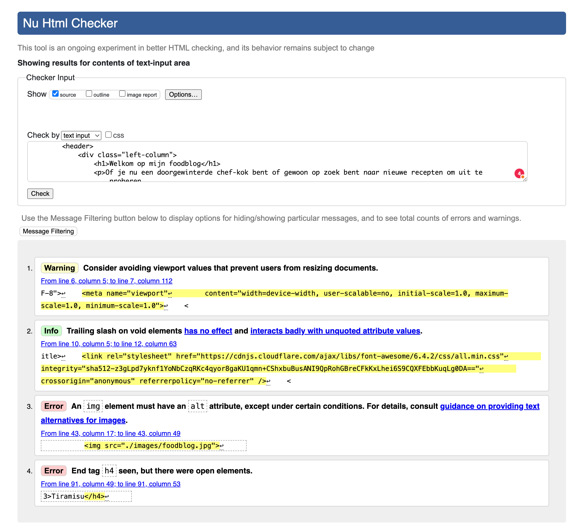
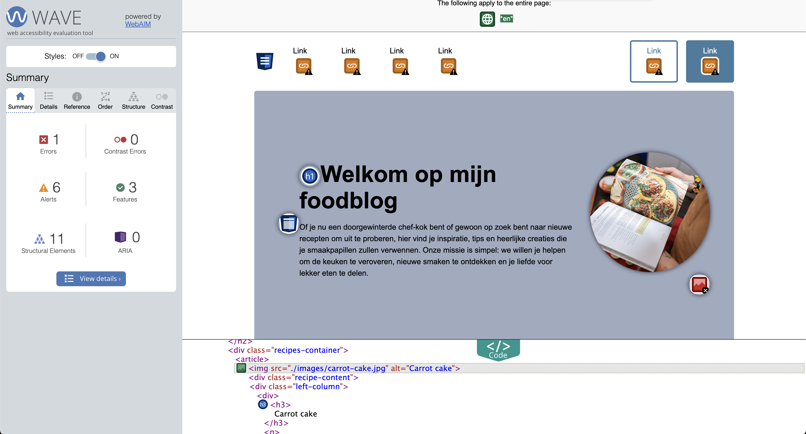
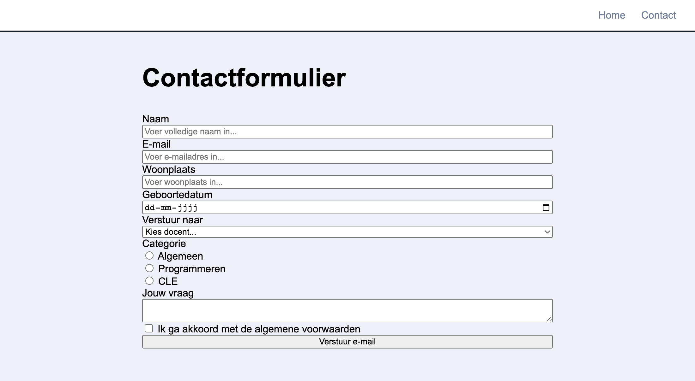
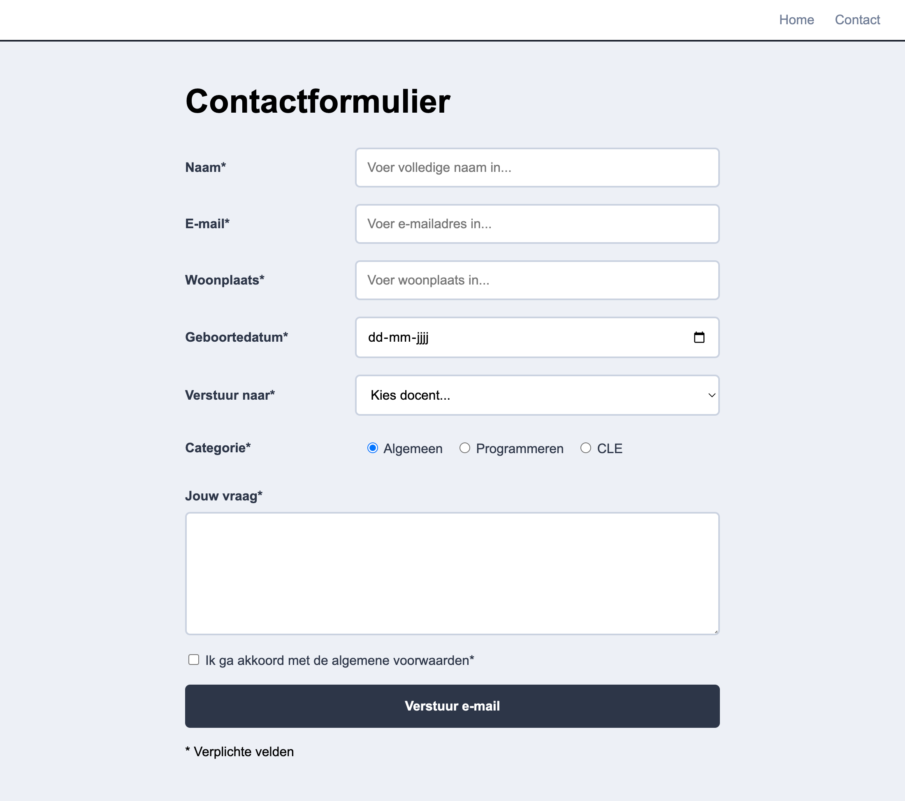
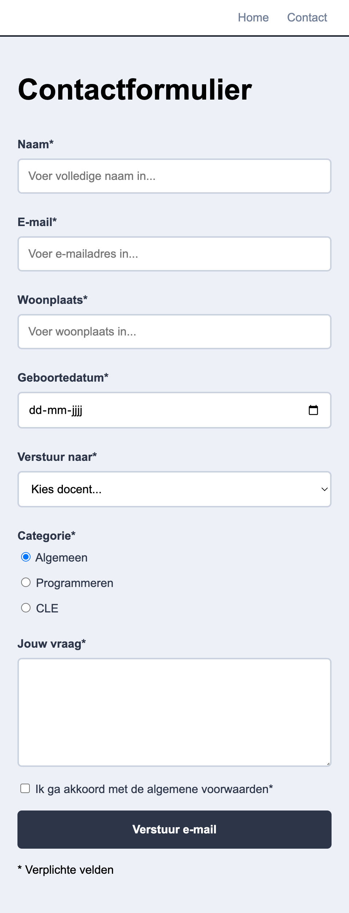
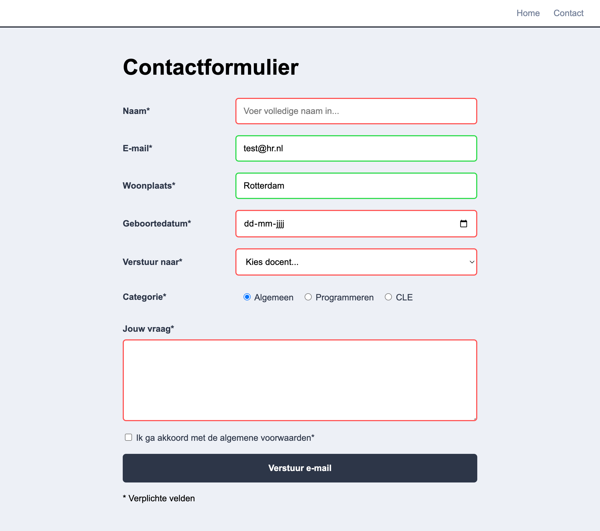

# Les 6

**Inhoudsopgave**

- [Les 6](#les-6)
  - [Leerdoelen](#leerdoelen)
- [Opdracht 1 - W3C validator](#opdracht-1---w3c-validator)
  - [De opdracht](#de-opdracht)
- [Opdracht 2: Wave accessibility tool](#opdracht-2-wave-accessibility-tool)
  - [De opdracht](#de-opdracht-1)
- [Formulieren](#formulieren)
  - [Type invoervelden](#type-invoervelden)
    - [Voorbeelden van input](#voorbeelden-van-input)
    - [Voorbeeld van select](#voorbeeld-van-select)
    - [Checkboxes](#checkboxes)
    - [Radio buttons](#radio-buttons)
    - [Meer form elementen](#meer-form-elementen)
  - [Required fields](#required-fields)
  - [Formulier versturen](#formulier-versturen)
    - [Data verwerken](#data-verwerken)
  - [Styling](#styling)
    - [Styling voor checkboxes en radio buttons](#styling-voor-checkboxes-en-radio-buttons)
  - [Formulier responsive maken](#formulier-responsive-maken)
    - [Mobile](#mobile)
  - [Validatie feedback met CSS](#validatie-feedback-met-css)
- [Opdracht 3 - Formulieren](#opdracht-3---formulieren)
  - [Opdracht 3a - Nieuw project opzetten](#opdracht-3a---nieuw-project-opzetten)
  - [Opdracht 3b - HTML formulier](#opdracht-3b---html-formulier)
  - [Opdracht 3c - CSS formulier](#opdracht-3c---css-formulier)
  - [Opdracht 3d - Responsive](#opdracht-3d---responsive)
  - [Opdracht 3e - Validatie](#opdracht-3e---validatie)
  - [Opdracht 3f - het formulier versturen](#opdracht-3f---het-formulier-versturen)
- [Links](#links)

<br><br><br>

## Leerdoelen

In deze les ligt de focus op het volgende leerdoel:

| Leerdoel                                                                                                                | Toelichting                                                                                                                                                   |
| ----------------------------------------------------------------------------------------------------------------------- | ------------------------------------------------------------------------------------------------------------------------------------------------------------- |
| 1. Ik kan de relatie tussen HTML en CSS uitleggen en kan hiermee een semantische en toegankelijke webpagina bouwen.     | In deze les leer je hoe je jouw HTML kan testen op correctheid kan maken en hoe je rekening houdt met toegankelijkheid. Ook leer je hoe je formulieren maakt. |
| 2. Ik kan uitleggen hoe een layout tot stand komt in de browser en kan een responsive webpagina bouwen met HTML en CSS. | In deze les leer je hoe je de layout van een formulier kan maken.                                                                                             |

<br>

Alle leerdoelen zijn terug te vinden in de
[cursushandleiding](https://brightspace.hr.nl/d2l/le/lessons/192811/topics/879825).

<br><br><br>

# Opdracht 1 - W3C validator

Wanneer je een website maakt is het belangrijk dat hier geen fouten in staan. Een manier om dit te voorkomen is door
handmatig op zoek te gaan naar fouten. Hoewel dit altijd onderdeel van het werk zal zijn, bestaan er ook tools die voor
jou geautomatiseerd op zoek gaan naar fouten. Vandaag ga je kijken naar de W3C validator.

De W3C validator controleert of jouw HTML voldoet aan alle regels die er zijn voor HTML. Het gebruik ervan is heel
simpel: je geeft het de HTML-code en je drukt op **_Check_**. Vervolgens krijg je een lijst met _errors_ en _warnings_
over jouw code, die je vervolgens kan oplossen.

## De opdracht

Voer de volgende stappen uit:

1. Ga naar de [W3C validator](https://validator.w3.org/#validate_by_input);
2. Standaard vraagt hij om een URL, maar als jouw website nog niet online staat kan je klikken op **_Validate by Direct
   Input_**, waarna je de HTML-code kan kopiëren en plakken;
3. Klik op de knop **_Check_**;
4. Je krijgt nu een lijst met _errors_ en _warnings_ en _info_ (zie screenshot hieronder). _Errors_ moet je altijd
   oplossen, _warnings_ zijn vaak een goed idee om op te lossen en _info_ is over het algemeen puur ter informatie.
5. Lees de meldingen aandachtig door en probeer ze op te lossen in de code. Begrijp je een melding niet? Kopieer de
   melding dan en plak deze in Copilot en vraag om een uitleg. Laat Copilot het niet voor jou oplossen, daar leer jij
   niets van.
6. Tip: W3C heeft ook een [CSS validator](https://jigsaw.w3.org/css-validator/#validate_by_input).



<br><br><br>

# Opdracht 2: Wave accessibility tool

Een website maak je zodat mensen deze kunnen gebruiken. Er is echter een grote groep mensen die door een handicap
websites niet kunnen gebruiken zoals de meeste mensen dat doen. Denk maar bijvoorbeeld aan mensen met een visuele
beperking, waardoor ze niet alles of zelfs helemaal niets kunnen zien. Het is belangrijk dat jij als developer rekening
houdt met deze groep mensen. Dit is sinds 28 juni 2025 voor veel bedrijven zelfs verplicht geworden om te doen door de
[European Accessibility Act](https://ondernemersplein.overheid.nl/european-accessibility-act-.producten-en-diensten-moeten-volledig-toegankelijk-zijn/).

In deze opdracht ga je kennismaken met de tool **Wave** die jou inzicht geeft in de belangrijke onderdelen waar je
rekening mee moet houden tijdens het bouwen van een website, zodat iedereen ter wereld jouw websites kan gebruiken.

## De opdracht

Voer de volgende stappen uit:

1. Installeer de extensie van Wave in
   [Chrome](https://chromewebstore.google.com/detail/wave-evaluation-tool/jbbplnpkjmmeebjpijfedlgcdilocofh),
   [Edge](https://microsoftedge.microsoft.com/addons/detail/wave-evaluation-tool/khapceneeednkiopkkbgkibbdoajpkoj) of
   [Firefox](https://addons.mozilla.org/en-US/firefox/addon/wave-accessibility-tool/);
2. Ga naar de website van jouw keuze en klik rechts bovenin op het icoontje van deze extensie (de letter W);
3. Wave voert nu een test uit en links in het scherm zie je het resultaat hiervan.
4. 💡 Tip: klik onderin op de knop **Code**, zodat je meteen de bijbehorende code ziet wanneer je op een error o.i.d.
   klikt.



<br><br><br>

# Formulieren

Het is met HTML mogelijk om een formulier te maken die de gebruiker kan invoeren. Met CSS is dit formulier vervolgens
volledig naar wens te vormgeven. In deze les zal je leren hoe je zo'n formulier maakt, welke opties er zijn en hoe je
deze vormgeeft.

Hieronder vind je een voorbeeld van een standaard formulier:

```html
<form>
  <label for="first-name">Voornaam</label>
  <input type="text" name="first-name" id="first-name" />

  <label for="last-name">Achternaam</label>
  <input type="text" name="last-name" id="last-name" />

  <button type="submit">Verzenden</button>
</form>
```

<br><br>

## Type invoervelden

In een formulier plaats je de gewenste invoervelden. De meeste invoervelden maak je met de HTML-tag `<input>`, maar er
zijn ook een aantal andere HTML-tags. In de tabellen hieronder staan de meestgebruikte HTML-tags voor invoervelden en
de meestgebruikte input-types.

<br>

**HTML-tags voor invoervelden**

| HTML-tag | Omschrijving                                                                                                                                                                                                                                                                |
| -------- | --------------------------------------------------------------------------------------------------------------------------------------------------------------------------------------------------------------------------------------------------------------------------- |
| input    | Meestgebruikte HTML-tag voor invoervelden. Door het attribuut `type` in te voeren bepaal je het type invoerveld. Zie de tabel hieronder met de meestgebruikte input-types.                                                                                                  |
| textarea | Een tekstveld met meerdere regels. Hierin kan je dus ook enters invoeren.                                                                                                                                                                                                   |
| select   | Een dropdown om een lijst met opties weer te geven. Iedere optie voer je in de `<select>` in als `<option>`. De gebruiker kan maximaal 1 optie kiezen.                                                                                                                      |
| label    | Dit is geen invoerveld, maar de label die aangeeft wat de inhoud van het bijbehorende invoerveld moet zijn. Ieder invoerveld moet een label hebben. Wanneer je op de label klikt, wordt het bijbehorende invoerveld geselecteerd (mits je de koppeling juist hebt gemaakt). |

<br><br>

**Input-types**

De tag `<input>` kan je gebruiken voor meerdere type invoervelden. De keuze maak je door het attribuut `type` in te
voeren. Dus bijvoorbeeld `<input type="email">`. In de tabel hieronder vind je de types die we voor deze les nodig
hebben. Hier vind je alle mogelijke input-types:
[https://www.w3schools.com/html/html_form_input_types.asp](https://www.w3schools.com/html/html_form_input_types.asp)

| Input-type | Omschrijving                    |
| ---------- | ------------------------------- |
| text       | Invoerveld voor tekst           |
| email      | Invoerveld voor een emailadres. |
| checkbox   | Invoeren van een checkbox       |
| radio      | Invoeren van een radio-button   |
| date       | Invoeren van een datepicker     |

<br>

### Voorbeelden van input

```html
<label for="first-name">Naam:</label>
<input type="text" id="first-name" name="first-name" />

<label for="birthdate">Datum</label>
<input type="date" id="birthdate" name="birthdate" />

<label for="email">Email</label>
<input type="email" id="email" name="email" />
```

<br>Met het attribuut `placeholder` kan je de gebruiker een voorbeeld geven van wat er in het veld ingevuld moet
worden:

```html
<input type="email" id="email" name="email" placeholder="studentnummer@hr.nl" />
```

<br>

### Voorbeeld van select

```HTML
<label for="cars">Kies een auto</label>
<select id="cars" name="cars">
    <option value="" disabled selected>Kies een auto</option>
    <option value="volvo">Volvo</option>
    <option value="saab">Saab</option>
    <option value="fiat">Fiat</option>
    <option value="audi">Audi</option>
</select>
```

<br>

### Checkboxes

```html
<input type="checkbox" id="cat" name="cat" value="Cat" />
<label for="cat">Ik heb een kat</label>

<input type="checkbox" id="dog" name="dog" value="Dog" />
<label for="dog">Ik heb een hond</label>

<input type="checkbox" id="capibara" name="capibara" value="Capibara" />
<label for="capibara">Ik heb een capibara</label>
```

<br>

### Radio buttons

Let op dat je hier het attribuut `name` voor iedere input hetzelfde moet invoeren. De gebruiker kan hierdoor maar één
van de opties selecteren.

```html
<input type="radio" id="pizza" name="menu" value="pizza" />
<label for="pizza">Pizza</label>

<input type="radio" id="sushi" name="menu" value="sushi" />
<label for="sushi">Sushi</label>

<input type="radio" id="kaas" name="menu" value="kaas" />
<label for="kaas">Kaassoufflé</label>
```

<br>

> _Het label is niet alleen voor de leesbaarheid maar helpt ook om de "click area" van het element groter te maken_

### Meer form elementen

Op W3Schools vind je nog meer voorbeelden voor [Forms](https://www.w3schools.com/html/html_forms.asp) en
[Form Elements](https://www.w3schools.com/html/html_form_elements.asp)

<br>
<br>

## Required fields

Je kan velden verplicht maken met het attribuut `required`. Wanneer de gebruiker dan het formulier submit, terwijl het
verplichte veld nog leeg is, dan wordt hier een melding van getoond en wordt het formulier niet verzonden. Dit
attribuut verwacht geen waarde. Je zet dus niet `required=""` neer, maar slechts `required`.

> _Let op dat dit niet gebruikt kan worden voor security (het `required` field is te omzeilen via de browser
> inspector), maar daarover volgende periode meer bij Programmeren 2._

```html
<label for="username">Username:</label> <input type="text" id="username" name="username" required />
```

<br><br>

## Formulier versturen

Om de data van je formulier te kunnen versturen moet je **_alle_** invulvelden binnen een `<form>` staan. Die moet weer
het attribuut `action` bevatten, waarin bepaald naar welke URL het formulier verzonden moet worden.

Om het formulier te kunnen verzenden heb je wel een submit button nodig! Zie hieronder een voorbeeld van een formulier
met submit button.

```html
<form action="contact-bedankt.html">
  <!-- Hier komen ALLE form elementen -->

  <!-- De submit button verstuurt het formulier -->
  <button type="submit">Versturen</button>
</form>
```

### Data verwerken

In kwartaal 2 en 3 gaan we leren hoe we de ingevulde data uit het formulier kunnen gebruiken in onze applicatie.

- Kwartaal 2: Gebruik **PHP** om de data op te slaan in een database.
- Kwartaal 3: Gebruik **Javascript** om de data te gebruiken in een front-end applicatie.

<br><br>

## Styling

De default styling van veel form-elementen is niet erg mooi en niet optimaal leesbaar. Gelukkig kan je form-elementen
volledig naar wens vormgeven met CSS. Een aantal tips om het leesbaarder te maken:

- stel de `font-size` van de inputs in op de standaard font-size door deze op `1rem` in te stellen;
- voeg `padding` toe om de leesbaarheid te verbeteren.
- gebruik `accent-color` om al je input elementen een default kleur te geven die past bij je website.

```css
/* voorbeeld: alle input elementen */
input {
  font-size: 1rem;
  accent-color: red;
}
/* voorbeeld: alleen text input */
input[type="text"] {
  padding: 2px;
  font-size: 1rem;
}

select {
  padding: 6px;
  font-size: 1rem;
  border: 0;
}
```

<br>Ook de submit button is geheel naar wens vorm te geven. Dit werkt nagenoeg hetzelfde zoals je een `<a>` zou
vormgeven, met als uitzondering dat op een button de muisaanwijzer niet automatisch een handje wordt wanneer die op de
button staat. Dit kan je oplossen door de CSS-optie `cursor` op `pointer` in te stellen. Je kan `all:unset;` gebruiken
om alle default styling van een button te verwijderen.

```css
button {
  all: unset;
  padding: 6px;
  font-size: 1rem;
  border-radius: 8px;
  border: 0;
  background-color: darkblue;
  color: white;
  cursor: pointer;
}

button:hover {
  background-color: lightblue;
  color: darkblue;
}

button:active {
  background-color: red;
}
```

<br>

### Styling voor checkboxes en radio buttons

Behalve [accent color](https://developer.mozilla.org/en-US/docs/Web/CSS/accent-color) zijn er niet veel mogelijkheden
om checkboxes en radio buttons te stylen. Je kan echter wel je eigen checkbox / radio button bouwen.
[Bekijk hier een voorbeeld.](https://www.w3schools.com/howto/howto_css_custom_checkbox.asp).

<br>
<br>
<br>

## Formulier responsive maken

Op desktop zet je de labels meestal naast je form-element. Dit kan je doen door het label en form-element in een `div`
te plaatsen die je vervolgens als Flexbox instelt.

```html
<div class="formfield">
  <label for="name">Naam</label>
  <input type="text" name="name" id="name" />
</div>

<div class="formfield">
  <label for="email">Email</label>
  <input type="email" name="email" id="email" />
</div>
```

```css
.formfield {
  display: flex;
  justify-content: space-between;
  flex-direction: row;
}
```

### Mobile

Op mobile veranderen we de `flex-direction` in `column` zodat de items onder elkaar komen te staan.

```css
@media (max-width: 480px) {
  .formfield {
    flex-direction: column;
  }
}
```

<br><br>

## Validatie feedback met CSS

Je kan via CSS de stijl aanpassen van een form element dat niet goed is ingevuld.

```html
<input type="email" required placeholder="piet@henk.nl" />
```

```css
input:user-invalid {
  background-color: pink;
  border: 2px solid red;
}
```

<br><br>

# Opdracht 3 - Formulieren

In de komende opdrachten werk je toe naar een compleet formulier met alle opties die hierboven zijn besproken. Dit
formulier ga je op een andere pagina maken dan de homepage. Dus je hebt de `index.html`, waar je tot nu toe in het hebt
gewerkt, wat de homepage is. In onderstaande opdracht ga je ook een `contact.html` maken, waarin jouw formulier komt te
staan. Dit bestand bekijk je via een andere URL dan de homepage, waardoor je dus twee verschillende pagina's kan
bezoeken.

<br>

## Opdracht 3a - Nieuw project opzetten

Voor de lesopdracht van vandaag moet je een nieuw project opzetten, anders kan je opdracht 6 namelijk niet uitvoeren.
Voer de volgende stappen uit:

1. Maak een nieuw project aan en noem die `forms`, zoals omschreven in
   [opdracht 1e van les 1](../les1/#opdracht-1d---eerste-project-aanmaken). Zet daarin de bestandsstructuur neer, zoals
   omschreven in [opdracht 1e uit les 1](../les1/#opdracht-1e---bestandsstructuur-html-en-css).
2. Maak vervolgens in de nieuwe map `forms` nog een bestand aan met de naam `contact.html`. Kopieer de volledige inhoud
   van `index.html` en plak deze in `contact.html`. Dubbelcheck of je nu in beide bestanden dezelfde link hebt naar de
   `style.css`, zodat je dezelfde stijl op beide pagina's kan gebruiken.
3. Kopieer vervolgens onderstaande startcode. Pas nog wel in beide HTML-bestanden de `href` van alle linkjes aan in de
   `<nav>`, zodat deze linken naar de juiste pagina. Voor meer info over hoe je dit correct instelt,
   [lees dit dan hier terug bij les 3](../les3/#html-voor-de-navigatie).
4. Open de `index.html` met Live Server en controleer of de navigatie werkt. Wanneer je naar de andere pagina navigeert
   zou de `<h1>` moeten veranderen, want die is anders per pagina, maar de vormgeving zou wel hetzelfde moeten blijven.

<br>

> ⚠️ Zorg ervoor dat je de HTML-code **_in de `<body>`_** plakt!

<br>

**index.html**

```html
<nav>
  <a href="">Home</a>
  <a href="">Contact</a>
</nav>

<main>
  <div class="center-container">
    <section>
      <h1>Homepage</h1>
    </section>
  </div>
</main>
```

<br>

**contact.html**

```html
<nav>
  <a href="">Home</a>
  <a href="">Contact</a>
</nav>

<main>
  <div class="center-container">
    <section>
      <h1>Contactformulier</h1>
    </section>
  </div>
</main>
```

<br>

**style.css**

```css
* {
  box-sizing: border-box;
}

body {
  margin: 0;
  font-family: Arial, Helvetica, sans-serif;
  background-color: #edf0f7;
}

h1 {
  font-size: 2.5rem;
  margin-top: 0;
}

.center-container {
  margin: 0 auto;
  width: 90vw;
  max-width: 650px;
}

nav {
  background-color: #ffffff;
  padding: 15px 30px;
  display: flex;
  justify-content: flex-end;
  gap: 25px;
  border-bottom: 2px solid #1a202c;
}

nav a {
  color: #717d96;
  text-decoration: none;
}

nav a:hover {
  text-decoration: underline;
}

main {
  padding: 50px 0;
}
```

<br><br>

## Opdracht 3b - HTML formulier

In deze opdracht ga je de HTML van het formulier schrijven. Bouw hiervoor het formulier in onderstaand ontwerp na. Zorg
ervoor dat het er inhoudelijk echt hetzelfde uitziet. Dus voer ook de `placeholders` in, maak alle velden `required` en
kies de juiste `type` per veld.

Het enige wat je voor deze opdracht in de CSS moet doen is ervoor zorgen dat de inhoud van `<form>` als een `column`
wordt weergegeven, zodat alles onder elkaar komt te staan.

Bij de `<select>` onder \*Verstuur naar\*\* moet je kunnen kiezen uit de volgende docenten: Antwan, Erik en Martijn.

> Wil je het formulier ook echt versturen? Kijk dan naar [opdracht 6](#opdracht-6-het-formulier-versturen).



<br><br>

## Opdracht 3c - CSS formulier

Op dit moment is alle HTML geschreven, maar het ziet er nog niet zo mooi uit. Schrijf daarom de CSS, zodat het eruit
ziet als onderstaand ontwerp. Bedenk hoe je `Flexbox` hiervoor kan inzetten.



<br><br>

## Opdracht 3d - Responsive

Je formulier ziet er nu mooi uit! Maar op mobile wordt het erg krap. Zorg er daarom voor dat jouw formulier eruit ziet
zoals in onderstaand ontwerp.



<br><br>

## Opdracht 3e - Validatie

Jouw formulier ziet er nu mooi uit én is goed leesbaar op mobile. De laatste stap is om `validatie` toe te passen. Dat
betekent dat je aangeeft welke velden correct zijn ingevoerd en welke nog niet. Dus wanneer er bijvoorbeeld geen naam
is ingevoerd moet dat veld een rode rand krijgen. Zo wordt het voor de gebruiker duidelijk welke velden er nog
ingevoerd moeten worden. Zorg er daarom voor dat jouw formulier er hetzelfde uitziet als in onderstaand ontwerp.



<br><br>

## Opdracht 3f - het formulier versturen

Tijdens dit vak ga je niet leren hoe je dit formulier kan verzenden, dat komt in de volgende periode. Om je toch te
laten zien dat je dit formulier nu daadwerkelijk kan verzenden hebben we een testfunctie gemaakt waardoor jouw
formulier wordt gemaild. Voer daarvoor de volgende stappen uit:

1. In de `<select>` kies je een docent en naar diegene wordt jouw vraag gemaild. Om dit werkend te maken moet je bij
   ieder formulier-element de juiste `name` invoeren. De volgende names zijn nodig: 'name', 'city', 'email',
   'birthdate', 'category', 'question' en 'send-to'. Iedere docent heeft trouwens een eigen nummer die je als `value`
   in moet stellen: 0 = Antwan, 1 = Erik en 2 = Martijn.

2. Vervang de openings `<form>` tag voor onderstaande. De betekenis van deze attributen leer je bij Programmeren 2.

```html
<form action="https://docent.cmi.hr.nl/moora/frontend/send-mail.php" method="POST"></form>
```

3. Maak in de map van deze opdracht (dus `forms`) een nieuw bestand aan met de naam `contact-bedankt.html`. Nadat je
   het formulier hebt verzonden word je automatisch doorgestuurd naar deze pagina. Zet hierop een tekst als _"Bedankt
   voor je vraag, de gekozen docent zal er zo snel mogelijk op reageren."_. Test of het werkt door op de `submit`
   button te klikken.

<br><br>

# Links

- [Codepen voorbeeld](https://codepen.io/eerk/pen/BaxYjqz?editors=1100)
- [MDN uitleg voor het uitlijnen van labels](https://developer.mozilla.org/en-US/docs/Web/HTML/Element/label)
- [Codepen voorbeeld met uitgebreide responsive styling](https://codepen.io/CityRay/pen/vXEaZj)
- [autocomplete](https://developer.mozilla.org/en-US/docs/Web/HTML/Attributes/autocomplete)
- [Toegankelijkheids richtlijnen voor formulieren](https://digitaaltoegankelijk.nl/nieuws/web-formulieren-en-de-wcag-waar-moet-je-op-letten/)
