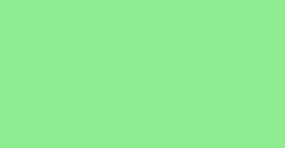
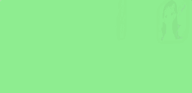
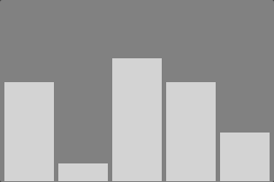
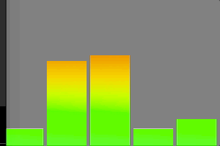

# Les 7

**Inhoudsopgave**

- [Les 7](#les-7)
  - [Leerdoelen](#leerdoelen)
- [What CSS can do](#what-css-can-do)
- [Transition](#transition)
- [Filter, transform en 3D-effect](#filter-transform-en-3d-effect)
  - [Filter](#filter)
  - [Transform](#transform)
  - [3D-effect](#3d-effect)
- [Animation](#animation)
- [Position fixed](#position-fixed)
  - [Sticky](#sticky)
- [Opdracht 1 - Foodblog animeren](#opdracht-1---foodblog-animeren)
  - [Transition op nav bar](#transition-op-nav-bar)
  - [Fixed nav bar](#fixed-nav-bar)
  - [Fancy cards](#fancy-cards)
  - [Chat request](#chat-request)
  - [Zelfstandig oefenen](#zelfstandig-oefenen)
    - [Falling cards](#falling-cards)
    - [Audio bars](#audio-bars)
- [Responsive design](#responsive-design)
- [Links](#links)

<br><br><br>

## Leerdoelen

In deze les ligt de focus op het volgende leerdoel:

| Leerdoel                                                                                       | Toelichting                                                                                     |
| ---------------------------------------------------------------------------------------------- | ----------------------------------------------------------------------------------------------- |
| 3. Ik kan animaties bouwen en uitleggen waarom dit een aanvulling is op de gebruikerservaring. | In deze les leer je hoe je met transitions en animations de gebruikerservaring kunt verbeteren. |

<br>

Alle leerdoelen zijn terug te vinden in de [cursushandleiding](https://brightspace.hr.nl/d2l/home/192811) @TODO: juiste
link invoeren.

<br><br><br>

# What CSS can do

Je kan ontzettend veel toffe animaties maken met CSS. Zie hieronder wat inspiratie.

- <a href="https://codepen.io/spark" target="_blank">Codepen Spark</a>
  _(<a href="https://codepen.io/Jopzik/pen/yLGMzOK" target="_blank">kat in wasmachine</a> en
  <a href="https://codepen.io/hluebbering/pen/dywzPre" target="_blank">glas effect</a>)_, en
  <a href="https://a.singlediv.com/" target="_blank">A single div</a>
- <a href="https://css-tricks.com" target="_blank">CSS Tricks</a> - cool card navigation
- <a href="https://linktr.ee/" target="_blank">Linktree</a> - background blur en ronddraaiende cards

<br><br><br>

# Transition

Met een _transition_ kan je bepalen hoe snel de CSS van een element verandert. Dit past goed bij `hover` effecten, en
werkt voor bijna alle eigenschappen, zoals:

- kleur,
- afmeting,
- transform,
- margin, padding
- box-shadow,
- css filter

In dit voorbeeld komt een kaartje in 1 seconde los van de ondergrond on mouse hover. De _transition_ komt langzaam op
gang, en remt aan het einde weer af (ease).

```css
.card {
  color: white;
  background-color: lightgrey;
  transform-origin: center;
  transition: all 1s ease;
}
.card:hover {
  color: black;
  background-color: darkgrey;
  box-shadow: 5px 5px 10px rgb(0 0 0 / 0.4);
  transform: scale(1.2);
}
```

<br>

**Hulpbronnen**

- <a href="https://www.w3schools.com/css/css3_transitions.asp" target="_blank">Documentatie transition</a>

<br><br><br>

# Filter, transform en 3D-effect

Je kunt met CSS meerdere effecten toepassen op HTML-elementen. Hieronder staan er drie toegelicht.

<br>

## Filter

Er zijn verschillende filters beschikbaar die je op je elementen kan loslaten. Deze filters werken goed samen met
transitions en animations.

```css
div {
  filter: blur(20px) brightness(50%) saturate(4) hue-rotate(24deg);
}
```

<br>

**Hulpbronnen**

- <a href="https://developer.mozilla.org/en-US/docs/Web/CSS/filter-function" target="_blank">Documentatie CSS
  filter</a>
- <a href="https://css-tricks.com/almanac/properties/f/filter/" target="_blank">Tutorial over CSS filter</a>
- <a href="https://www.youtube.com/watch?v=qyUz1iF8E6Y" target="_blank">Video over CSS filter</a>

<br>

## Transform

Met transform kan je een element schalen, roteren of verplaatsen, zonder dat je layout verstoord wordt. Dit werkt vaak
goed samen met `hover` effecten en animaties. Als je meerdere transforms wil combineren moet je die samen op 1 regel
plaatsen. Met `translate` verplaats je het element op de x,y as. Met `transform-origin` bepaal je het middelpunt van de
transform.

```css
div {
  transform: scale(2) rotate(10deg) translate(10px, 10px);
  transform-origin: center;
}
```

  <br>
  
  **Hulpbronnen**
  - <a href="https://developer.mozilla.org/en-US/docs/Web/CSS/transform?retiredLocale=nl" target="_blank">Documentatie transform</a>
  - <a href="https://css-tricks.com/almanac/properties/t/transform/" target="_blank">Tutorial over transform</a>
  - <a href="https://www.youtube.com/watch?v=rzD-cPhq02E" target="_blank">Video over transform</a>
  - <a href="https://www.youtube.com/shorts/-RhONXwP2AQ" target="_blank">Video met voorbeelden van transform</a>
  - <a href="https://www.youtube.com/watch?v=YszONjKpgg4" target="_blank">Video over transform én animation</a>
  
<br>

## 3D-effect

Je kan elementen roteren op een 3D as, met `rotateX`, `rotateY`, `rotateZ`. Je moet de parent container een
`perspective` waarde geven, dit is de afstand van het element tot de gebruiker.

```css
.parent {
  perspective: 100px;
}
.child {
  transform: rotateY(20deg);
}
```

<br>

**Hulpbronnen**

- <a href="https://css-tricks.com/how-css-perspective-works/" target="_blank">Tutorial over 3D-effect</a>
- <a href="https://www.youtube.com/watch?v=A6gYSyiEvjM" target="_blank">Video over 3D-effect (let op: voorbeeld is in
  SCCS)</a>

<br><br><br>

# Animation

Een _animation_ bepaalt net als een _transition_ hoe de CSS van een element verandert. Je hebt alleen veel meer
controle over wat er met het element gebeurt. Een animatie kan je laten afspelen tussen twee of meer keyframes. De
animatie kan automatisch afspelen, en je kan meerdere complexe animaties na elkaar laten afspelen. Om te beginnen
bepaal je met CSS `@keyframes` welke eigenschappen gaan animeren.

```css
@keyframes my-cool-animation {
  from {
    opacity: 0;
    transform: translateX(20%);
  }
  to {
    opacity: 1;
    transform: translateX(0%);
  }
}
```

Vervolgens kan je de keyframes toekennen aan een element via het `animation` keyword. Hierin kan je ook aangeven hoe
lang de animatie duurt, of het moet herhalen, etc.

```css
div {
  animation: 3s ease-in infinite my-cool-animation;
}
```

<br>

> De browser inspector heeft een <a href="https://youtu.be/w4J8sJpHKvw?si=NnAbrkcKg81YJfFA" target="_blank">animation
> inspector</a> om de timing van je animaties mee te ontwerpen.

<br>

**Hulpbronnen**

- <a href="https://developer.mozilla.org/en-US/docs/Web/CSS/animation" target="_blank">Documentatie animation</a>
- <a href="https://www.youtube.com/watch?v=YszONjKpgg4" target="_blank">Video over transform én animation</a>

<br><br><br>

# Position fixed

We hebben geleerd dat layout elementen automatisch door de browser worden gepositioneerd, dit noemen we "document flow"
of <a href="https://developer.mozilla.org/en-US/docs/Learn/CSS/CSS_layout/Normal_Flow" target="_blank">"normal
flow"</a>. Er zijn gevallen waarin je zelf de positie van een element wil hardcoderen, waarbij het geen deel uitmaakt
van die flow. _Bijvoorbeeld: een chat venster dat altijd rechtsonderin je pagina blijft staan_. Met de eigenschap
`position:fixed` wordt een element uit de flow gehaald. Je kan het nu zelf positioneren met `bottom, top, left, right`.
Het element blijft op die plek staan zelfs als het venster scrolt.

```css
.chatwindow {
  position: fixed;
  bottom: 20px;
  right: 20px;
}
```

## Sticky

Een sticky element krijgt een `fixed` position zodra de gebruiker een bepaald punt voorbij scrolt. Dit werkt goed voor
`nav` elementen.

```css
nav.sticky {
  position: sticky;
  top: 20px;
}
```

<br><br><br>

# Opdracht 1 - Foodblog animeren

Voer onderstaande opdrachten uit op de Foodblog die je in een eerdere les hebt gemaakt. Maak eventueel een kopie van
dat project als je het origineel wilt behouden.

## Transition op nav bar

- Plaats een `hover` effect op je nav bar buttons.
- Gebruik `transition` om de hover te animeren.

## Fixed nav bar

- Gebruik `position:sticky` en `top:0` om de nav bar vast te zetten, zelfs als de pagina scrolt.

## Fancy cards

- Plaats een aantal divs naast elkaar met de class `card`.
- On `hover` maak je de card groter met `transform:scale(1.1)` en je voegt een schaduw toe met `box-shadow`.
- Geef de card een `transition` zodat de animatie geleidelijk gaat.

## Chat request

- Ontwerp een chat window in een eigen div element, onder je andere html code.
- Gebruik `position fixed` met `bottom, right` om het chat window rechtsonderin beeld te fixeren, ongeacht de
  scroll-positie.
- Met `transform:translateX()` plaats je nu het chat window rechts _buiten_ beeld
- Ontwerp een `@keyframes` animatie die de `translateX()` weer terug op 0 zet.
- Gebruik `animation` om het chat window te animeren. De animatie speelt maar 1x, dit doe je met `forwards`.

<br><br><br>

## Zelfstandig oefenen

- Falling Cards
- Audio Bars

Gebruik de <a href="https://www.w3schools.com/cssref/css3_pr_animation.php" target="_blank">animation</a> en
<a href="https://www.w3schools.com/cssref/css3_pr_animation-keyframes.php" target="_blank">keyframes</a> documentatie
om de oefeningen te kunnen maken.

<br>

### Falling cards

- Plaats een aantal `cards` naast elkaar in een section met `flex`. Dit is de eindpositie. Geef de section een
  `perspective` van bv. 200px.
- Geef de cards een startpositie, van waaruit ze straks in beeld gaan vallen. Dit doe je met `opacity` en verschillende
  `transforms`, zoals `scale`, `rotateY` en `translateZ`.
- In je `@keyframes` animatie zet je de cards weer terug op hun eindpositie. Je kan hier `transform:none` gebruiken.
- Gebruik `animation` om de cards te animeren. De animatie speelt maar 1x, dit doe je met
  `ease-out animation forwards`.
- Geef elke card een `id`. Gebruik `animation-delay` om _elke kaart een eigen delay_ te geven. Daardoor vallen ze na
  elkaar in beeld.
- Gebruik de <a href="./easing-editor.png" target="_blank">easing inspector</a> om de kaartjes te laten stuiteren.

VOORBEELD



STARTCODE

HTML

```html
<section>
  <div>Luffy</div>
  <div>Zoro</div>
  <div>Nami</div>
  <div>Sanji</div>
  <div>Tony</div>
  <div>Franky</div>
  <div>Brook</div>
  <div>Jinbei</div>
</section>
```

CSS

```
section {
  display: flex;
  justify-content: space-between;
  flex-wrap: wrap;
  gap: 20px;
}

section div {
  background-color: white;
  width: 120px;
  height: 120px;
  border-radius: 20px;
  padding: 20px;
}

@keyframes {
    from {

    }
    to {

    }
}
```

ADVANCED

- Gebruik `background-image:url()` en `text-shadow` om de kaartjes vorm te geven!



<br><br><br>

### Audio bars

- Plaats vijf divs naast elkaar in een flex container. Geef de divs een achtergrondkleur.
- Gebruik [keyframes](https://www.w3schools.com/cssref/css3_pr_animation-keyframes.php) om de `height` van een bar te
  animeren. Je kan meerdere stappen in een animatie maken, zodat de bar niet meteen van vol naar leeg gaat.
- Geef elke bar een `id`. Geef elke bar een eigen `animation` met verschillende `time` en de `delay`.
- De animaties zijn `alternate infinite` zodat het eeuwig doorgaat en weer terug gaat naar de beginpositie.

VOORBEELD



STARTCODE

HTML

```html
<section>
  <div></div>
  <div></div>
  <div></div>
  <div></div>
  <div></div>
</section>
```

CSS

```css
section {
  width: 300px;
  height: 200px;
  display: flex;
  gap: 5px;
  align-items: end;
}
section div {
  background-color: grey;
  flex: 1;
  height: 100%;
}
@keyframes {
  0% {
  }
  25% {
  }
  50% {
  }
  100% {
  }
}
```

Advanced

- Geef de bars [deze background image](./audiobar-background.jpg) zodat de bar van groen naar rood gaat. Dit doe je met
  `background-image:url()`.
- Gebruik `background-position:bottom` zodat groen onderaan staat.
- Gebruik `background-size:100px 200px` zodat de achtergrondafmeting hetzelfde is als de bar.

VOORBEELD



<Br><br><br>

# Responsive design

Op mobiel wil je wellicht geen `hover` effecten hebben, omdat er geen muispointer is. Je kan dit oplossen met
`@media (hover: hover) {}`. Dit is een media query die alleen wordt uitgevoerd als de gebruiker een muispointer heeft.

```css
@media (hover: hover) {
  /* css die alleen werkt als er een muispointer is */
}
```

<Br><br><br>

# Links

- [Video: Learn CSS animation in 15 minutes](https://www.youtube.com/watch?v=YszONjKpgg4)
- [W3Schools animations](https://www.w3schools.com/css/css3_animations.asp)
- [MDN Animations](https://developer.mozilla.org/en-US/docs/Web/CSS/animation)
- [CSS Filter](https://developer.mozilla.org/en-US/docs/Web/CSS/filter-function)
- [CSS Gradient](https://developer.mozilla.org/en-US/docs/Web/CSS/gradient/linear-gradient)
- [Blend mode](https://codepen.io/tommiehansen/pen/BaGyVVy)
- [Ontwerp easing met de browser inspector](./easing-editor.png) of kies een [custom easing](https://easings.net/)
- [Achterkant Div](https://css-tricks.com/almanac/properties/b/backface-visibility/) en
  [voorbeeld](https://codepen.io/eerk/pen/WNLdrLK)
- [Animatie gebaseerd op scroll](https://developer.mozilla.org/en-US/blog/scroll-progress-animations-in-css/)
- [Animeer een SVG illustratie](https://codepen.io/eerk/pen/ZPzNqv) en
  [meer voorbeelden](https://codepen.io/collection/nRJxyn)
- [Tools om CSS animaties en shapes te ontwerpen](https://dev.to/lissy93/super-useful-css-resources-1ba3)
